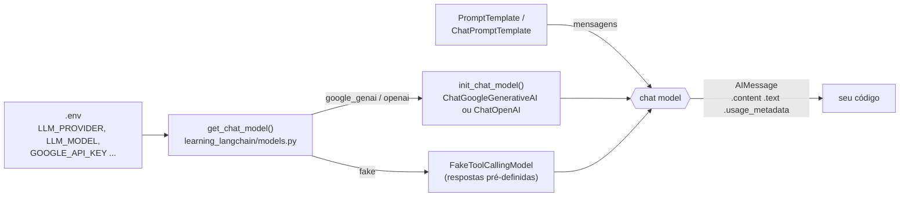

<!-- TOC -->

- [Módulo 1 - Fundamentos](#módulo-1---fundamentos)
  - [Visão geral](#visão-geral)
  - [O que você vai aprender](#o-que-você-vai-aprender)
  - [Arquitetura](#arquitetura)
  - [Conceitos, com analogias](#conceitos-com-analogias)
    - [Modelo de chat (chat model)](#modelo-de-chat-chat-model)
    - [Mensagens e papéis](#mensagens-e-papéis)
    - [Templates de prompt](#templates-de-prompt)
    - [invoke, stream e batch](#invoke-stream-e-batch)
    - [Temperatura](#temperatura)
  - [Os scripts](#os-scripts)
  - [Como executar](#como-executar)
  - [Exemplos de código](#exemplos-de-código)
  - [Testes](#testes)
  - [Erros comuns](#erros-comuns)
  - [Referências](#referências)

<!-- TOC -->

# Módulo 1 - Fundamentos

## Visão geral

Este módulo mostra as peças básicas de qualquer aplicação com LangChain:
**criar um modelo de chat, conversar com ele por mensagens e montar prompts
reutilizáveis**. Nenhum script aqui usa ferramentas, agentes ou bancos de
vetores - isso vem nos módulos seguintes.

Todos os scripts funcionam **sem chave de API** com `LLM_PROVIDER=fake`
(veja [`REQUIREMENTS.md`, seção 5](../REQUIREMENTS.md#5-chaves-de-api-e-o-arquivo-env)).

## O que você vai aprender

- O que é um *chat model* e como criá-lo com `init_chat_model()` ou com a
  classe do provedor (`ChatGoogleGenerativeAI`, `ChatOpenAI`).
- O que vem dentro da resposta (`AIMessage`): `.content`, `.text` e
  `.usage_metadata`.
- Mensagens com papéis (`SystemMessage`, `HumanMessage`, `AIMessage`) e por
  que o modelo "esquece" tudo que você não reenviar.
- Templates de prompt: `PromptTemplate` e `ChatPromptTemplate`.
- As três formas de chamar um modelo: `invoke()`, `stream()` e `batch()`.

## Arquitetura

O caminho de uma pergunta até a resposta, em todos os scripts deste módulo:



<details><summary>Versão em texto</summary>

```
.env (LLM_PROVIDER) --> get_chat_model()
                          |-- google_genai/openai --> init_chat_model("provedor:modelo")
                          |-- fake ---------------> FakeToolCallingModel (sem rede)
prompt (texto ou mensagens) --> chat model --> AIMessage (.content, .text, .usage_metadata)
```

</details>

## Conceitos, com analogias

### Modelo de chat (chat model)

Um *chat model* é um LLM (Large Language Model) que recebe uma **lista de
mensagens** e devolve **uma mensagem**. Segundo a documentação oficial, os
modelos são o "motor de raciocínio" dos agentes, e a interface padrão do
LangChain permite trocar de provedor sem reescrever o código.

> **Analogia:** pense no LangChain como uma **tomada universal**. O Gemini,
> o GPT e o modelo falso deste repositório são aparelhos com plugues
> diferentes; `init_chat_model("google_genai:gemini-3.7-flash")` é o
> adaptador. O resto do seu código só enxerga a tomada (`invoke`, `stream`,
> `batch`) e não se importa com o aparelho.

Há duas formas de criar um modelo (veja `2-init-chat-model.py`):

| Forma | Exemplo | Quando usar |
|---|---|---|
| `init_chat_model()` | `init_chat_model("google_genai:gemini-3.7-flash", temperature=0.5)` | trocar de provedor mudando só uma string |
| Classe do provedor | `ChatGoogleGenerativeAI(model="gemini-3.7-flash")` | usar parâmetros específicos daquele provedor |

Neste repositório, `learning_langchain/models.py` tem a função
`get_chat_model()`, que lê `LLM_PROVIDER` e chama `init_chat_model()` - ou
devolve o modelo falso quando `LLM_PROVIDER=fake`.

### Mensagens e papéis

| Classe | Papel | Para que serve |
|---|---|---|
| `SystemMessage` | `system` | instruções gerais de comportamento ("você é um assistente de SRE") |
| `HumanMessage` | `user` | o que a pessoa usuária escreveu |
| `AIMessage` | `assistant` | a resposta do modelo (pode conter `tool_calls`, módulo 3) |
| `ToolMessage` | `tool` | o resultado de uma ferramenta (módulo 3) |

Modelos de chat **não guardam estado** entre chamadas. Para "lembrar" de uma
conversa, o seu código precisa reenviar o histórico inteiro a cada chamada
(`5-messages.py`).

> **Analogia:** o modelo é um atendente de *call center* sem memória: a cada
> ligação ele lê, do zero, todo o histórico do chamado que você mandar junto.
> Se você não mandar, para ele a conversa nunca aconteceu. (No módulo 3 o
> *checkpointer* faz esse trabalho por você.)

### Templates de prompt

Um template é um texto fixo com campos `{entre_chaves}` preenchidos na hora
da chamada.

> **Analogia:** é uma **carta modelo** - "Prezado(a) {nome}, seu pedido
> {numero} foi enviado" - em que só os campos mudam.

- `PromptTemplate`: gera **um texto** (`format()` devolve uma `str`).
- `ChatPromptTemplate`: gera **uma lista de mensagens** com papéis
  (`format_messages()`), que é o que um *chat model* recebe.

### invoke, stream e batch

| Método | O que faz | Analogia |
|---|---|---|
| `invoke(entrada)` | espera a resposta completa | baixar o filme inteiro antes de assistir |
| `stream(entrada)` | devolve a resposta em pedaços (`AIMessageChunk`) assim que são gerados | assistir enquanto baixa (*streaming*) |
| `batch([e1, e2])` | processa várias entradas independentes, em paralelo por padrão, e devolve as respostas **na mesma ordem** | vários caixas de supermercado atendendo ao mesmo tempo |

`batch()` aceita `config={"max_concurrency": N}` para limitar quantas
chamadas rodam ao mesmo tempo - útil para respeitar limites de requisições
(*rate limits*) do provedor.

### Temperatura

`temperature` controla quanta aleatoriedade há na escolha das palavras:
valores baixos dão respostas mais previsíveis; valores altos, mais variadas.
Este repositório usa `0.5` como padrão (`LLM_TEMPERATURE`, entre 0 e 2).

> **Cuidado:** no `langchain-openai` 1.6.7, modelos `gpt-5` (exceto
> `gpt-5-chat`) só aceitam `temperature=1`; outro valor é **descartado**
> pela própria biblioteca (veja `langchain_openai/chat_models/base.py`).
> Por isso, com `LLM_PROVIDER=openai` e o modelo padrão `gpt-5-nano`, o
> valor de `LLM_TEMPERATURE` não tem efeito.

## Os scripts

| # | Script | Conceito | Precisa de modelo? |
|---|---|---|---|
| 1 | [`1-hello-world.py`](1-hello-world.py) | `invoke()` e a `AIMessage` | sim (ou `fake`) |
| 2 | [`2-init-chat-model.py`](2-init-chat-model.py) | `init_chat_model()` x classe do provedor | sim (ou `fake`) |
| 3 | [`3-prompt-template.py`](3-prompt-template.py) | `PromptTemplate`, `from_template()` | não |
| 4 | [`4-chat-prompt-template.py`](4-chat-prompt-template.py) | `ChatPromptTemplate` e papéis | sim (ou `fake`) |
| 5 | [`5-messages.py`](5-messages.py) | histórico de mensagens | sim (ou `fake`) |
| 6 | [`6-streaming-and-batch.py`](6-streaming-and-batch.py) | `stream()` e `batch()` | sim (ou `fake`) |

## Como executar

```bash
# Um script (usa o provedor do seu .env)
uv run python 1-fundamentals/1-hello-world.py

# O mesmo script sem chave de API e sem custo
LLM_PROVIDER=fake uv run python 1-fundamentals/1-hello-world.py

# Todos os scripts do módulo, em ordem (atalho do Makefile)
make run-module MODULE=1-fundamentals
make run-module MODULE=1-fundamentals LLM_PROVIDER=fake
```

Saída de `LLM_PROVIDER=fake uv run python 1-fundamentals/5-messages.py`
(executado ao escrever este material):

```
Bot: Nice to meet you, Ana! Kubernetes is a great topic for a DevOps engineer.
Bot: Your name is Ana.

History sent on the last call:
  SystemMessage: You are a concise assistant for DevOps engineers.
  HumanMessage: Hi, my name is Ana and I'm studying Kubernetes.
  AI: Nice to meet you, Ana! Kubernetes is a great topic for a DevOps engineer.
  HumanMessage: What is my name?
  AI: Your name is Ana.
```

Com um provedor real, as respostas mudam a cada execução - o texto acima
vem das respostas pré-definidas do modo `fake`.

## Exemplos de código

O mínimo para conversar com um modelo (trecho de `1-hello-world.py`):

```python
from dotenv import load_dotenv
from learning_langchain.models import get_chat_model

load_dotenv()  # reads GOOGLE_API_KEY / LLM_PROVIDER from .env

model = get_chat_model()
response = model.invoke("Hello, how are you?")
print(response.text)  # only the text
print(response.usage_metadata)  # token counts, when the provider reports them
```

Sem o helper do repositório, direto com a API oficial do LangChain:

```python
from langchain.chat_models import init_chat_model

model = init_chat_model("google_genai:gemini-3.7-flash", temperature=0.5)
print(model.invoke("Why do parrots talk?").text)
```

Um `ChatPromptTemplate` (trecho de `4-chat-prompt-template.py`):

```python
from langchain_core.prompts import ChatPromptTemplate

chat_prompt = ChatPromptTemplate(
    [
        ("system", "You are a helpful assistant that translates {input_language} to {output_language}."),
        ("user", "{sentence}"),
    ]
)
messages = chat_prompt.format_messages(
    input_language="Portuguese", output_language="English", sentence="Eu estou aprendendo LangChain."
)
```

## Testes

Os testes deste módulo estão em
[`tests/unit/test_1_fundamentals.py`](../tests/unit/test_1_fundamentals.py)
e rodam sem rede, com o modelo falso:

```bash
uv run pytest tests/unit/test_1_fundamentals.py -v
```

Um exemplo - o histórico cresce a cada turno porque o código reenvia tudo:

```python
def test_messages_history_grows_with_every_turn():
    script = load_script("1-fundamentals/5-messages.py")
    model = script.get_chat_model(fake_responses=["a1", "a2"])
    history = []
    script.chat(model, history, "q1")
    script.chat(model, history, "q2")
    assert [m.text for m in history] == ["q1", "a1", "q2", "a2"]
```

Veja [`docs/TESTING.md`](../docs/TESTING.md) para entender `load_script()`
e o modelo falso.

## Erros comuns

| Sintoma | Causa provável | Correção |
|---|---|---|
| Erro de autenticação / chave inválida | `GOOGLE_API_KEY` ou `OPENAI_API_KEY` ausente ou errada no `.env` | confira o `.env` ([`REQUIREMENTS.md`, seção 5](../REQUIREMENTS.md#5-chaves-de-api-e-o-arquivo-env)) ou use `LLM_PROVIDER=fake` |
| Erro dizendo que o modelo não existe | nome de modelo desatualizado (eles mudam com frequência) | defina `LLM_MODEL` com um modelo listado pelo provedor; o script `3-tools-and-agents/4-agent-review.py` lista os modelos Gemini da sua chave |
| `ValueError: LLM_PROVIDER must be one of ...` | valor inválido em `LLM_PROVIDER` | use `google_genai`, `openai` ou `fake` |
| `ModuleNotFoundError: learning_langchain` | script executado fora do ambiente do projeto | rode com `uv run python ...` a partir da raiz do repositório |

Mais casos em [`docs/TROUBLESHOOTING.md`](../docs/TROUBLESHOOTING.md).

## Referências

- [LangChain - Models](https://docs.langchain.com/oss/python/langchain/models)
- [LangChain - Messages](https://docs.langchain.com/oss/python/langchain/messages)
- [LangChain - Streaming](https://docs.langchain.com/oss/python/langchain/streaming)
- [ChatGoogleGenerativeAI integration](https://docs.langchain.com/oss/python/integrations/chat/google_generative_ai)
- [ChatOpenAI integration](https://docs.langchain.com/oss/python/integrations/chat/openai)
- [Gemini API - modelos](https://ai.google.dev/gemini-api/docs/models)
- [OpenAI - modelos](https://platform.openai.com/docs/models)
