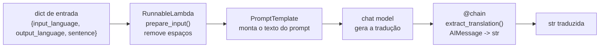
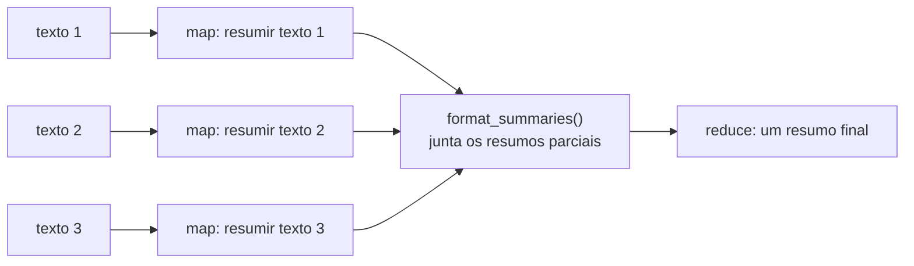

<!-- TOC -->

- [Módulo 2 - Chains e processos (LCEL)](#módulo-2---chains-e-processos-lcel)
  - [Visão geral](#visão-geral)
  - [O que você vai aprender](#o-que-você-vai-aprender)
  - [Arquitetura](#arquitetura)
  - [Conceitos, com analogias](#conceitos-com-analogias)
    - [Runnable e o operador `|`](#runnable-e-o-operador-)
    - [`RunnableLambda` e `@chain`](#runnablelambda-e-chain)
    - [Output parsers](#output-parsers)
    - [Saída estruturada](#saída-estruturada)
    - [`RunnableParallel` e `RunnablePassthrough`](#runnableparallel-e-runnablepassthrough)
    - [Map-reduce](#map-reduce)
    - [Modo debug](#modo-debug)
  - [Os scripts](#os-scripts)
  - [Como executar](#como-executar)
  - [Exemplos de código](#exemplos-de-código)
  - [Testes](#testes)
  - [Erros comuns](#erros-comuns)
  - [Referências](#referências)

<!-- TOC -->

# Módulo 2 - Chains e processos (LCEL)

## Visão geral

Uma *chain* (cadeia) liga várias etapas - preparar a entrada, montar o
prompt, chamar o modelo, tratar a resposta - em um único objeto que você
chama com `invoke()`. No LangChain 1.x isso é feito com a **LCEL**
(*LangChain Expression Language*): o operador `|` encadeia *Runnables*.

> **Importante:** o pacote `langchain.chains` (classes legadas como
> `load_summarize_chain`) **não existe** no LangChain 1.x. Tutoriais
> anteriores à versão 1.0 que o usam não funcionam aqui; o script
> `5-sumarization-map-reduce-pipeline.py` mostra como fazer o mesmo com LCEL.

## O que você vai aprender

- O que é um `Runnable` e como o `|` liga um ao outro.
- Colocar código Python comum no meio de uma chain (`RunnableLambda`, `@chain`).
- Converter a resposta em `str`, `list` ou em um objeto Pydantic validado.
- Rodar ramos em paralelo com `RunnableParallel`.
- Um pipeline *map-reduce* de resumo, feito à mão com LCEL.
- Ver cada etapa no console com `set_debug(True)`.

## Arquitetura

Uma chain é uma linha de montagem: cada etapa recebe a saída da anterior.
A chain do script `4-chain-of-translate.py`:



O *map-reduce* do script 5:



<details><summary>Versão em texto</summary>

```
4-chain-of-translate.py:
  {input_language, output_language, sentence}
    | prepare_input (RunnableLambda) | translation_template | model | extract_translation (@chain) -> str

5-sumarization-map-reduce-pipeline.py:
  [doc1, doc2, doc3] | map_documents (1 chamada ao modelo por doc) | format_summaries | reduce_template | model
```

</details>

## Conceitos, com analogias

### Runnable e o operador `|`

Prompts, modelos, parsers, retrievers e ferramentas implementam a mesma
interface, `Runnable`: todos têm `invoke()`, `stream()` e `batch()`. Por isso
podem ser encadeados com `|`.

> **Analogia:** é o *pipe* do Linux. Em `cat app.log | grep ERROR | wc -l`,
> a saída de um comando vira a entrada do próximo. Em
> `prompt | model | StrOutputParser()`, o dicionário vira prompt, o prompt
> vira `AIMessage` e a `AIMessage` vira `str`.

### `RunnableLambda` e `@chain`

Transformam uma função Python comum em `Runnable`, para usá-la no meio de
uma chain. `RunnableLambda(funcao)` embrulha uma função existente; o
decorador `@chain` faz o mesmo na definição da função.

> **Analogia:** um adaptador que deixa qualquer peça encaixar na linha de
> montagem, mesmo que ela não tenha sido fabricada para isso.

### Output parsers

Convertem a `AIMessage` no tipo que o seu código precisa:

| Parser | Entrada -> saída |
|---|---|
| `StrOutputParser()` | `AIMessage` -> `str` (o mesmo texto de `message.text`) |
| `CommaSeparatedListOutputParser()` | `"a, b, c"` -> `["a", "b", "c"]`; `get_format_instructions()` devolve a instrução de formato para o prompt |

### Saída estruturada

`model.with_structured_output(MinhaClassePydantic)` faz o modelo responder
preenchendo um *schema*; o resultado é um objeto Python validado. As
descrições dos campos (`Field(description=...)`) são enviadas ao modelo e
fazem parte do prompt.

> **Analogia:** em vez de uma folha em branco, você entrega ao modelo um
> **formulário** com campos obrigatórios e opções fixas (`Literal["low",
> "medium", "high", "critical"]`). Se ele preencher um campo com um valor
> fora das opções, a validação do Pydantic recusa.

### `RunnableParallel` e `RunnablePassthrough`

`RunnableParallel(a=..., b=...)` executa cada ramo com **a mesma entrada**,
ao mesmo tempo, e devolve um `dict` com uma chave por ramo.
`RunnablePassthrough()` apenas repassa a entrada sem alterar - útil para
mantê-la no resultado (e é peça central do RAG no módulo 4).

> **Analogia:** uma equipe dividindo uma tarefa: cada pessoa faz a sua parte
> ao mesmo tempo, e no fim alguém junta os resultados em uma planilha com
> uma coluna por pessoa.

### Map-reduce

Para resumir muitos textos: primeiro resume cada um separadamente (**map**),
depois combina os resumos parciais em um só (**reduce**).

> **Analogia:** cada pessoa de um grupo de estudo resume um capítulo (map);
> depois, uma pessoa editora junta as anotações no resumo do livro (reduce).

### Modo debug

`langchain_core.globals.set_debug(True)` imprime cada etapa
(`chain/start`, `llm/start`, `llm/end`, ...) no console. Já
`set_verbose(True)` **não tem efeito visível** em pipelines LCEL nesta
versão - por isso o repositório usa `set_debug`.

## Os scripts

| # | Script | Conceito |
|---|---|---|
| 1 | [`1-starting-chain.py`](1-starting-chain.py) | `prompt \| model` |
| 2 | [`2-chains-with-decorators.py`](2-chains-with-decorators.py) | `@chain` |
| 3 | [`3-runnable-lambda.py`](3-runnable-lambda.py) | `RunnableLambda` antes e depois do modelo |
| 4 | [`4-chain-of-translate.py`](4-chain-of-translate.py) | chain reutilizável com variáveis dinâmicas |
| 5 | [`5-sumarization-map-reduce-pipeline.py`](5-sumarization-map-reduce-pipeline.py) | map-reduce com LCEL, `set_debug`, entrada interativa |
| 6 | [`6-output-parsers.py`](6-output-parsers.py) | `StrOutputParser`, `CommaSeparatedListOutputParser` |
| 7 | [`7-structured-output.py`](7-structured-output.py) | `with_structured_output()` + Pydantic |
| 8 | [`8-runnable-parallel.py`](8-runnable-parallel.py) | `RunnableParallel`, `RunnablePassthrough` |

## Como executar

```bash
uv run python 2-chains-and-process/7-structured-output.py
LLM_PROVIDER=fake uv run python 2-chains-and-process/7-structured-output.py

make run-module MODULE=2-chains-and-process
```

O script 5 é interativo: pressione ENTER em cada pergunta para usar o valor
padrão (sem debug e três textos gerados pelo próprio modelo sobre a Copa do
Mundo FIFA 2026). Sem terminal - por exemplo em `make run-all` - as
perguntas recebem o padrão automaticamente.

Saída de `LLM_PROVIDER=fake uv run python 2-chains-and-process/7-structured-output.py`:

```
Incident -> service='checkout-api' severity='high' summary='Error rate above 20% right after deploy v2.3.1.' needs_rollback=True
Action: roll back checkout-api (severity: high)
```

## Exemplos de código

Uma chain completa, do dicionário à `str` (trecho de `6-output-parsers.py`):

```python
from langchain_core.output_parsers import StrOutputParser
from langchain_core.prompts import PromptTemplate

explain_prompt = PromptTemplate.from_template("Explain {tool} to a beginner in one sentence.")
chain = explain_prompt | model | StrOutputParser()
print(chain.invoke({"tool": "Docker"}))
```

Saída estruturada (trecho de `7-structured-output.py`):

```python
from typing import Literal
from pydantic import BaseModel, Field


class Incident(BaseModel):
    """An incident extracted from an alert message."""

    service: str = Field(description="Name of the affected service")
    severity: Literal["low", "medium", "high", "critical"] = Field(description="Incident severity")
    summary: str = Field(description="One-sentence summary of the problem")
    needs_rollback: bool = Field(description="True if the alert suggests rolling back a deployment")


chain = prompt | model.with_structured_output(Incident)
incident = chain.invoke({"alert": "checkout-api 5xx error rate is 23% after deploy v2.3.1"})
print(incident.severity, incident.needs_rollback)
```

## Testes

[`tests/unit/test_2_chains_and_process.py`](../tests/unit/test_2_chains_and_process.py)
mostra duas técnicas:

1. **Modelo falso com respostas fixas** (`GenericFakeChatModel`) para testar
   o que a chain faz com a resposta.
2. **Modelo "eco"** (`echo_model()` em [`tests/_helpers.py`](../tests/_helpers.py)),
   que responde com o próprio prompt recebido - para testar **o que a chain
   envia** ao modelo:

```python
def test_translation_chain_cleans_input_and_uses_both_languages():
    script = load_script("2-chains-and-process/4-chain-of-translate.py")
    result = script.build_chain(echo_model()).invoke(
        {"input_language": " English ", "output_language": "Portuguese ", "sentence": "  Hi  "}
    )
    assert "from English to Portuguese" in result
    assert "Sentence: Hi\n" in result
```

```bash
uv run pytest tests/unit/test_2_chains_and_process.py -v
```

## Erros comuns

| Sintoma | Causa provável | Correção |
|---|---|---|
| `ModuleNotFoundError: No module named 'langchain.chains'` | código de tutorial anterior ao LangChain 1.0 | reescreva com LCEL (veja o script 5) |
| `KeyError` / "missing variables" ao invocar | o dicionário não tem todas as variáveis do template | confira `prompt.input_variables` |
| `ValidationError` na saída estruturada | o modelo preencheu um campo fora do schema | melhore as descrições dos campos ou trate a exceção |
| `set_verbose(True)` não mostra nada | não tem efeito em LCEL nesta versão | use `set_debug(True)` |

## Referências

- [LangChain - Structured output](https://docs.langchain.com/oss/python/langchain/structured-output)
- [LangChain - Models (invoke, stream, batch, structured output)](https://docs.langchain.com/oss/python/langchain/models)
- [Referência de `langchain-core` - Runnables](https://reference.langchain.com/python/langchain-core/runnables)
- [Referência de `langchain-core` - Output parsers](https://reference.langchain.com/python/langchain-core/output_parsers)
- [Pydantic - Models](https://docs.pydantic.dev/latest/concepts/models/)
