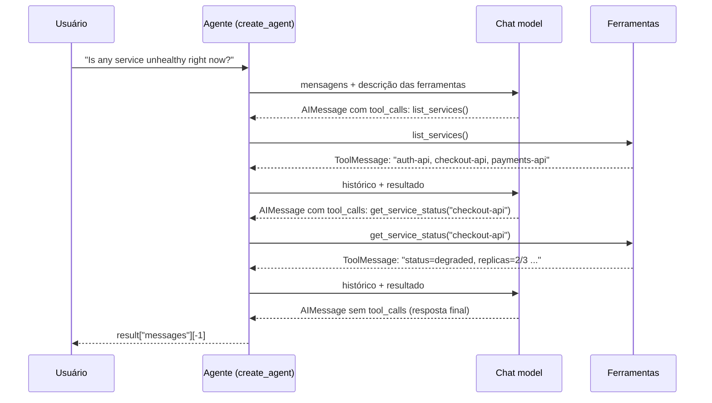

<!-- TOC -->

- [Módulo 3 - Ferramentas e agentes](#módulo-3---ferramentas-e-agentes)
  - [Visão geral](#visão-geral)
  - [O que você vai aprender](#o-que-você-vai-aprender)
  - [Arquitetura](#arquitetura)
  - [Conceitos, com analogias](#conceitos-com-analogias)
    - [Ferramenta (tool)](#ferramenta-tool)
    - [Agente](#agente)
    - [Memória de curto prazo (checkpointer)](#memória-de-curto-prazo-checkpointer)
    - [Chain ou agente?](#chain-ou-agente)
  - [Os scripts](#os-scripts)
  - [Como executar](#como-executar)
  - [Exemplos de código](#exemplos-de-código)
  - [Testes](#testes)
  - [Erros comuns e cuidados](#erros-comuns-e-cuidados)
  - [Referências](#referências)

<!-- TOC -->

# Módulo 3 - Ferramentas e agentes

## Visão geral

A documentação oficial define: **"um agente é um modelo chamando ferramentas
em um loop até que a tarefa esteja completa"**. Neste módulo você cria
ferramentas com `@tool`, monta agentes com `langchain.agents.create_agent`,
dá memória a eles com um *checkpointer* e termina com um agente que revisa
código Python lendo os arquivos por conta própria.

## O que você vai aprender

- Transformar uma função Python em ferramenta com `@tool` - e por que a
  *docstring* importa tanto quanto o código.
- Criar um agente com `create_agent(model, tools, system_prompt=...)`.
- Ler o resultado: `result["messages"]` contém a pergunta, cada chamada de
  ferramenta, cada resultado e a resposta final (`result["messages"][-1]`).
- Dar memória entre turnos com `InMemorySaver` e `thread_id`.
- Testar agentes sem LLM, roteirizando as chamadas de ferramenta.

## Arquitetura

O loop que `create_agent()` monta (um grafo do LangGraph por baixo), como no
script `2-simple-agent.py`:



<details><summary>Versão em texto</summary>

```
HumanMessage -> model -> AIMessage(tool_calls=[list_services])
             -> ToolMessage("auth-api, checkout-api, payments-api")
             -> model -> AIMessage(tool_calls=[get_service_status(checkout-api)])
             -> ToolMessage("checkout-api: status=degraded, replicas=2/3, version=v2.3.1")
             -> model -> AIMessage("checkout-api is degraded ...")   <- sem tool_calls: fim do loop
```

</details>

## Conceitos, com analogias

### Ferramenta (tool)

Uma função que o modelo pode **pedir** para executar. Com `@tool`
(`from langchain.tools import tool`):

- o **nome da função** vira o nome da ferramenta;
- a **docstring** vira a descrição;
- as **anotações de tipo** viram o *schema* dos argumentos.

O modelo nunca executa nada: ele devolve uma `AIMessage` com `tool_calls`
(nome + argumentos), e quem executa é o seu programa (o agente).

> **Analogia:** o modelo é um **chefe de cozinha** que não sai da bancada; as
> ferramentas são os ajudantes. O chefe lê o "cardápio de ajudantes" (nome +
> descrição) e grita "Ajudante `get_service_status`, verifique o
> `checkout-api`!". Se a descrição for vaga, ele chama o ajudante errado.

### Agente

`create_agent(model, tools, system_prompt=...)` devolve um grafo compilado
do LangGraph. Chame com `agent.invoke({"messages": [...]})`; o loop roda até
o modelo responder **sem** pedir ferramentas.

> **Analogia:** um **técnico de plantão** seguindo um runbook: olha o
> alerta, consulta o painel (ferramenta), consulta os logs (outra
> ferramenta), e só responde quando tem informação suficiente. O
> `system_prompt` é o treinamento que ele recebeu antes do plantão.

### Memória de curto prazo (checkpointer)

Passe `checkpointer=InMemorySaver()` para `create_agent` e um `thread_id` em
cada chamada (`config={"configurable": {"thread_id": "1"}}`). O agente
guarda o histórico de cada *thread* e você só envia a mensagem nova.

> **Analogia:** um **caderno com uma página por cliente**. O `thread_id` é o
> número da página; outra página é outra conversa, sem nada em comum.

`InMemorySaver` guarda tudo na RAM e perde ao encerrar o programa; a
documentação oficial usa um checkpointer com banco de dados (por exemplo
`PostgresSaver`, do pacote `langgraph-checkpoint-postgres`) em produção.

### Chain ou agente?

| | Chain (módulo 2) | Agente (este módulo) |
|---|---|---|
| Quem decide os passos | você, no código | o modelo, a cada iteração |
| Previsibilidade | alta | menor (o modelo pode escolher outro caminho) |
| Custo | número fixo de chamadas | variável (uma chamada por iteração do loop) |
| Bom para | fluxos conhecidos (traduzir, resumir, extrair) | tarefas abertas (investigar, revisar, pesquisar) |

## Os scripts

| # | Script | Conceito |
|---|---|---|
| 1 | [`1-first-tool.py`](1-first-tool.py) | `@tool`: nome, descrição, `args` e `invoke()` (sem modelo) |
| 2 | [`2-simple-agent.py`](2-simple-agent.py) | `create_agent` com ferramentas de "monitoramento" simuladas |
| 3 | [`3-agent-with-memory.py`](3-agent-with-memory.py) | `InMemorySaver` + `thread_id` |
| 4 | [`4-agent-review.py`](4-agent-review.py) | agente revisor de código: lista e lê arquivos `.py`, modo verbose |

> O inventário de serviços do script 2 é um dicionário fixo no código, para
> o exemplo ser seguro em qualquer máquina. Na vida real a ferramenta
> chamaria a API do Prometheus, do Kubernetes, de uma CMDB etc.

## Como executar

```bash
uv run python 3-tools-and-agents/2-simple-agent.py
LLM_PROVIDER=fake uv run python 3-tools-and-agents/2-simple-agent.py

make run-module MODULE=3-tools-and-agents
```

Saída de `LLM_PROVIDER=fake uv run python 3-tools-and-agents/2-simple-agent.py`
(ENTER na pergunta):

```
=== Agent steps ===
HumanMessage: Is any service unhealthy right now?
AIMessage: tool_calls=['list_services']
ToolMessage: auth-api, checkout-api, payments-api
AIMessage: tool_calls=['get_service_status']
ToolMessage: checkout-api: status=degraded, replicas=2/3, version=v2.3.1
AIMessage: checkout-api is degraded (2/3 replicas ready, version v2.3.1); the other services are healthy.
```

Repare: no modo `fake` as **ferramentas rodam de verdade** - só as decisões
do modelo são pré-definidas. O `ToolMessage` acima veio do dicionário
`SERVICES`.

O script 4 pergunta modelo, temperatura, diretório e modo verbose (ENTER =
padrão). Com `LLM_PROVIDER=google_genai`, ele antes lista os modelos Gemini
disponíveis para a sua chave, usando o SDK `google-genai`
(`genai.Client().models.list()`).

## Exemplos de código

Uma ferramenta e um agente (trechos de `2-simple-agent.py`):

```python
from langchain.agents import create_agent
from langchain.tools import tool


@tool
def get_service_status(service: str) -> str:
    """Get the status, ready replicas and deployed version of one service."""
    info = SERVICES.get(service)
    if info is None:
        return f"Unknown service '{service}'."
    return f"{service}: status={info['status']}, replicas={info['replicas']}"


agent = create_agent(model=model, tools=[list_services, get_service_status], system_prompt=SYSTEM_PROMPT)
result = agent.invoke({"messages": [{"role": "user", "content": "Is any service unhealthy?"}]})
print(result["messages"][-1].text)
```

Memória por conversa (trecho de `3-agent-with-memory.py`):

```python
from langgraph.checkpoint.memory import InMemorySaver

agent = create_agent(model=model, tools=[], checkpointer=InMemorySaver())
config = {"configurable": {"thread_id": "thread-1"}}
agent.invoke({"messages": [{"role": "user", "content": "Hi! I'm Bruno."}]}, config=config)
agent.invoke({"messages": [{"role": "user", "content": "What's my name?"}]}, config=config)
```

## Testes

O `GenericFakeChatModel` oficial não implementa `bind_tools()`, que o
`create_agent` chama antes de cada chamada ao modelo (a classe base levanta
`NotImplementedError`). Por isso o repositório tem `FakeToolCallingModel`
([`learning_langchain/models.py`](../learning_langchain/models.py)), uma
subclasse cujo `bind_tools()` devolve o próprio modelo. As respostas
roteirizadas - inclusive `AIMessage` com `tool_calls` - conduzem o loop:

```python
def test_agent_runs_the_tool_the_model_asked_for():
    script = load_script("3-tools-and-agents/2-simple-agent.py")
    agent = script.build_agent(build_fake_chat_model(script.FAKE_RESPONSES))
    result = agent.invoke({"messages": [{"role": "user", "content": "anything unhealthy?"}]})

    tool_results = [m for m in result["messages"] if isinstance(m, ToolMessage)]
    assert [m.name for m in tool_results] == ["list_services", "get_service_status"]
    assert "status=degraded" in tool_results[1].content
```

A memória é testada lendo o estado salvo de cada *thread* com
`agent.get_state(config)`. Tudo em
[`tests/unit/test_3_tools_and_agents.py`](../tests/unit/test_3_tools_and_agents.py):

```bash
uv run pytest tests/unit/test_3_tools_and_agents.py -v
```

## Erros comuns e cuidados

| Sintoma | Causa provável | Correção |
|---|---|---|
| `NotImplementedError` em `bind_tools` nos seus testes | `GenericFakeChatModel` com `create_agent` | use `FakeToolCallingModel` (ou uma subclasse igual) |
| O agente não chama a ferramenta | descrição vaga ou nome pouco claro | escreva uma docstring que diga **quando** usar a ferramenta |
| O agente não lembra da conversa | sem `checkpointer` ou `thread_id` diferente | passe `checkpointer=` e reutilize o mesmo `thread_id` |
| Respostas de texto vêm como lista | alguns provedores devolvem *content blocks* | use `message.text` em vez de `message.content` |

**Segurança:** ferramentas executam código de verdade com as permissões do
seu programa. Os exemplos aqui só **leem** (disco, arquivos, um dicionário).
Antes de dar a um agente ferramentas que alteram infraestrutura (reiniciar
serviços, aplicar Terraform), leia sobre *human-in-the-loop* e *guardrails*
na documentação oficial (links abaixo).

## Referências

- [LangChain - Agents](https://docs.langchain.com/oss/python/langchain/agents)
- [LangChain - Tools](https://docs.langchain.com/oss/python/langchain/tools)
- [LangChain - Short-term memory](https://docs.langchain.com/oss/python/langchain/short-term-memory)
- [LangChain - Unit testing](https://docs.langchain.com/oss/python/langchain/test/unit-testing)
- [LangChain - Human-in-the-loop](https://docs.langchain.com/oss/python/langchain/human-in-the-loop)
- [LangChain - Guardrails](https://docs.langchain.com/oss/python/langchain/guardrails)
- [Gemini API - listar modelos (`models.list`)](https://ai.google.dev/api/models)
