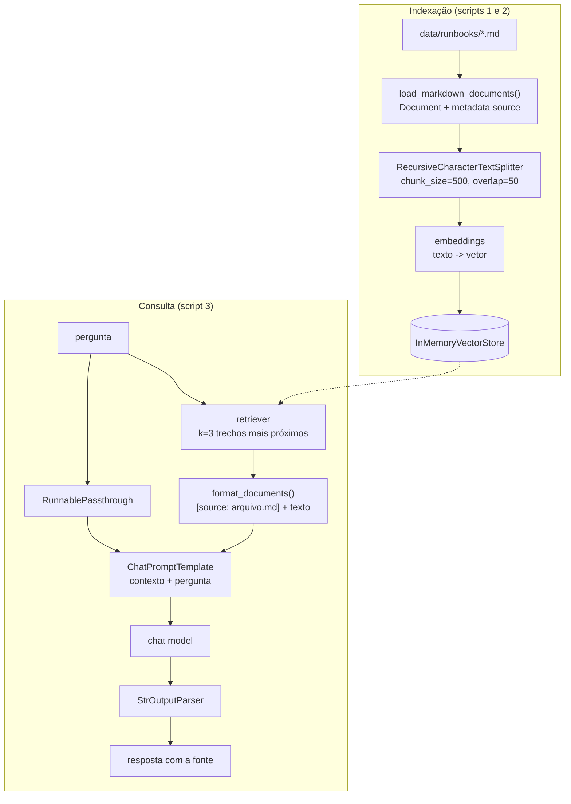

<!-- TOC -->

- [Módulo 4 - RAG (Retrieval-Augmented Generation)](#módulo-4---rag-retrieval-augmented-generation)
  - [Visão geral](#visão-geral)
  - [O que você vai aprender](#o-que-você-vai-aprender)
  - [Arquitetura](#arquitetura)
  - [Conceitos, com analogias](#conceitos-com-analogias)
    - [Por que RAG?](#por-que-rag)
    - [Document](#document)
    - [Text splitter (chunks)](#text-splitter-chunks)
    - [Embeddings](#embeddings)
    - [Vector store e retriever](#vector-store-e-retriever)
    - [RAG em 2 etapas x RAG com agente](#rag-em-2-etapas-x-rag-com-agente)
  - [A base de conhecimento de exemplo](#a-base-de-conhecimento-de-exemplo)
  - [Os scripts](#os-scripts)
  - [Como executar](#como-executar)
  - [Exemplos de código](#exemplos-de-código)
  - [Testes](#testes)
  - [Erros comuns](#erros-comuns)
  - [Referências](#referências)

<!-- TOC -->

# Módulo 4 - RAG (Retrieval-Augmented Generation)

## Visão geral

RAG (*geração aumentada por recuperação*) combina uma pergunta com trechos
de documentos **recuperados** de uma base de conhecimento, e só então pede a
resposta ao modelo. Assim o modelo responde sobre **os seus** documentos -
runbooks, wikis, políticas internas - que ele nunca viu no treinamento.

Este módulo segue o tutorial oficial
[*Build a semantic search engine*](https://docs.langchain.com/oss/python/langchain/knowledge-base)
(documentos, *splitters*, *embeddings*, *vector store*, *retriever*) e
termina com duas formas de RAG: uma chain fixa e um agente.

## O que você vai aprender

- `Document`: texto + metadados.
- Dividir textos em *chunks* com `RecursiveCharacterTextSplitter`.
- *Embeddings*: transformar texto em vetores de números.
- Guardar e buscar vetores com `InMemoryVectorStore` e `as_retriever()`.
- Montar uma chain de RAG com LCEL.
- Transformar a busca em uma ferramenta para um agente (RAG "agêntico").

## Arquitetura

Duas fases. A **indexação** roda uma vez (ou quando os documentos mudam); a
**consulta** roda a cada pergunta:



<details><summary>Versão em texto</summary>

```
Indexação: runbooks/*.md -> Document -> chunks (500 caracteres, 50 de sobreposição) -> embeddings -> InMemoryVectorStore
Consulta:  pergunta -> {context: retriever | format_documents, question: RunnablePassthrough()}
                    -> RAG_PROMPT -> model -> StrOutputParser -> resposta
Agente (script 4): pergunta -> create_agent(tools=[search_runbooks]) -> o modelo decide se/quanto buscar
```

</details>

## Conceitos, com analogias

### Por que RAG?

O modelo só sabe o que estava nos dados de treinamento. Colar **todos** os
seus documentos no prompt é caro e esbarra no limite de contexto. O RAG
envia apenas os trechos relevantes para cada pergunta.

> **Analogia:** uma **prova com consulta**. O modelo é o estudante; o
> retriever é o colega que encontra as 3 páginas certas do livro e entrega
> só elas. O prompt diz: "responda **apenas** com base nestas páginas".

### Document

`Document(page_content="...", metadata={"source": "high-cpu.md"})`: o texto
mais um dicionário de metadados.

> **Analogia:** um livro de biblioteca (o texto) com a sua ficha
> catalográfica (autor, estante). A ficha permite citar a fonte na resposta.

### Text splitter (chunks)

A documentação oficial recomenda `RecursiveCharacterTextSplitter` para texto
genérico: ele tenta cortar primeiro em parágrafos, depois linhas, depois
palavras, até cada pedaço caber em `chunk_size` caracteres.
`chunk_overlap` repete um pouco de texto entre pedaços vizinhos, e
`add_start_index=True` guarda a posição do pedaço em `metadata["start_index"]`.

> **Analogia:** fatiar um pão para caber na torradeira. A sobreposição
> garante que uma ideia cortada ao meio apareça inteira em pelo menos uma
> fatia.

### Embeddings

Um modelo de *embeddings* transforma texto em um vetor (lista de números).
Textos com significado parecido geram vetores próximos.

> **Analogia:** **coordenadas de GPS** para significados. "Disco cheio" e
> "sem espaço em disco" ficam no mesmo bairro; "certificado expirado" fica
> em outra cidade.

| `LLM_PROVIDER` | Embeddings usados | Modelo padrão (`LLM_EMBEDDING_MODEL`) |
|---|---|---|
| `google_genai` | `GoogleGenerativeAIEmbeddings` | `models/gemini-embedding-001` |
| `openai` | `OpenAIEmbeddings` | `text-embedding-3-large` |
| `fake` | `DeterministicFakeEmbedding(size=256)` | - |

> **Atenção ao modo `fake`:** `DeterministicFakeEmbedding` gera o **mesmo
> vetor para o mesmo texto**, mas textos parecidos **não** geram vetores
> parecidos. Serve para testes e para rodar os scripts sem custo, mas os
> resultados de busca no modo `fake` **não são semânticos**.

### Vector store e retriever

O *vector store* guarda cada chunk ao lado do seu vetor e encontra os mais
próximos do vetor da pergunta (`InMemoryVectorStore` usa similaridade de
cosseno e precisa do pacote `numpy`). `vector_store.as_retriever()` o
embrulha na interface padrão de *retriever*: um `Runnable` que recebe uma
string e devolve uma lista de `Document`.

`InMemoryVectorStore` guarda tudo na RAM; a documentação lista integrações
com bancos de vetores persistentes para uso real.

### RAG em 2 etapas x RAG com agente

| | Chain (`3-rag-chain.py`) | Agente (`4-rag-agent.py`) |
|---|---|---|
| Busca | sempre, exatamente uma vez | o modelo decide se, quantas vezes e com que termos |
| Chamadas ao modelo | 1 | 2 ou mais |
| Previsibilidade | alta | menor |

## A base de conhecimento de exemplo

[`data/runbooks/`](data/runbooks/) tem três runbooks **fictícios** (CPU alta,
disco cheio, certificado TLS expirando), escritos só como dados de exemplo -
cada arquivo diz isso no topo. Troque por seus próprios arquivos `.md` para
experimentar.

## Os scripts

| # | Script | Conceito | Precisa de modelo? |
|---|---|---|---|
| 1 | [`1-documents-and-splitters.py`](1-documents-and-splitters.py) | `Document`, `RecursiveCharacterTextSplitter` | não |
| 2 | [`2-embeddings-and-vector-store.py`](2-embeddings-and-vector-store.py) | embeddings, `InMemoryVectorStore`, `similarity_search_with_score` | embeddings (ou `fake`) |
| 3 | [`3-rag-chain.py`](3-rag-chain.py) | RAG com LCEL | sim (ou `fake`) |
| 4 | [`4-rag-agent.py`](4-rag-agent.py) | retriever como ferramenta de um agente | sim (ou `fake`) |

As funções reutilizadas pelos scripts 2-4 (carregar, dividir, indexar,
formatar) estão em [`learning_langchain/rag.py`](../learning_langchain/rag.py),
depois de serem ensinadas passo a passo nos scripts 1 e 2.

## Como executar

```bash
uv run python 4-rag/3-rag-chain.py
LLM_PROVIDER=fake uv run python 4-rag/3-rag-chain.py

make run-module MODULE=4-rag
```

Saída de `LLM_PROVIDER=fake uv run python 4-rag/1-documents-and-splitters.py`
(início):

```
Loaded 3 documents from .../4-rag/data/runbooks:
  - certificate-expiry.md: 617 characters
  - disk-full.md: 494 characters
  - high-cpu.md: 727 characters

Split into 5 chunks. First chunk:
  metadata: {'source': 'certificate-expiry.md', 'start_index': 0}
```

## Exemplos de código

A chain de RAG (trecho de `3-rag-chain.py`):

```python
from langchain_core.output_parsers import StrOutputParser
from langchain_core.runnables import RunnableLambda, RunnablePassthrough

retriever = vector_store.as_retriever(search_kwargs={"k": 3})
rag_chain = (
    {"context": retriever | RunnableLambda(format_documents), "question": RunnablePassthrough()}
    | RAG_PROMPT
    | model
    | StrOutputParser()
)
print(rag_chain.invoke("checkout-api has high CPU. What should I do?"))
```

O retriever como ferramenta (trecho de `4-rag-agent.py`):

```python
@tool
def search_runbooks(query: str) -> str:
    """Search the operational runbooks and return the most relevant passages."""
    return format_documents(vector_store.similarity_search(query, k=3))


agent = create_agent(model=model, tools=[search_runbooks], system_prompt="...")
```

## Testes

[`tests/unit/test_4_rag.py`](../tests/unit/test_4_rag.py) testa cada etapa
sem rede:

- os chunks respeitam `chunk_size` e têm `source` e `start_index`;
- como os embeddings falsos são determinísticos, buscar o **texto exato** de
  um chunk devolve esse chunk;
- com um retriever fixo e o `echo_model()`, o prompt enviado ao modelo
  contém o contexto e a pergunta;
- o agente chama a ferramenta de busca e recebe trechos com a fonte.

```bash
uv run pytest tests/unit/test_4_rag.py -v
```

## Erros comuns

| Sintoma | Causa provável | Correção |
|---|---|---|
| `NameError: name 'np' is not defined` | `numpy` não instalado (o `InMemoryVectorStore` e os embeddings falsos precisam dele) | `uv sync` (o `numpy` está em `pyproject.toml`) |
| A resposta inventa coisas fora dos documentos | o prompt não restringe o contexto, ou os trechos certos não foram recuperados | mantenha a instrução "use ONLY the context"; aumente `k`; ajuste `chunk_size` |
| Buscas sem sentido | `LLM_PROVIDER=fake` (embeddings não semânticos) | use um provedor real para avaliar a qualidade da busca |
| Erro de cota/limite nas embeddings | muitas chamadas ao indexar | indexe menos arquivos ou espere o limite do provedor |

## Referências

- [LangChain - Build a semantic search engine (knowledge base)](https://docs.langchain.com/oss/python/langchain/knowledge-base)
- [Referência de `langchain-text-splitters`](https://reference.langchain.com/python/langchain-text-splitters/base/TextSplitter)
- [LangChain - Embedding models](https://docs.langchain.com/oss/python/integrations/embeddings)
- [LangChain - Vector stores](https://docs.langchain.com/oss/python/integrations/vectorstores)
- [Gemini API - Embeddings](https://ai.google.dev/gemini-api/docs/embeddings)
- [OpenAI - Embeddings](https://platform.openai.com/docs/guides/embeddings)
