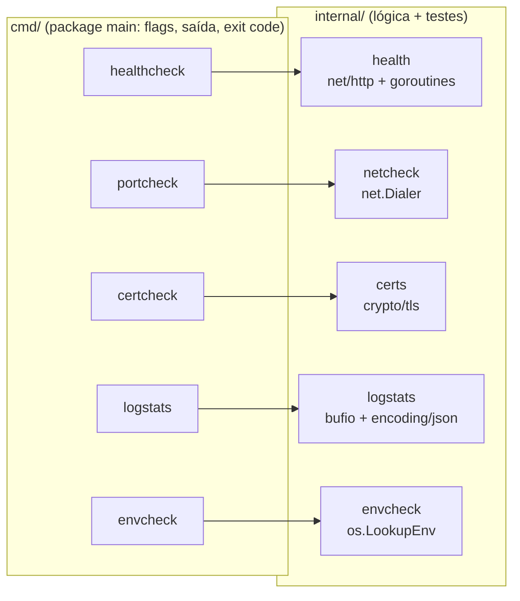

<!-- TOC -->

- [Módulo 5 - Go no dia a dia de DevOps e Cloud](#módulo-5---go-no-dia-a-dia-de-devops-e-cloud)
  - [Visão geral](#visão-geral)
  - [Por que Go para infraestrutura?](#por-que-go-para-infraestrutura)
  - [O que você vai aprender](#o-que-você-vai-aprender)
  - [Arquitetura do módulo](#arquitetura-do-módulo)
  - [Conceitos de Go, com analogias](#conceitos-de-go-com-analogias)
    - [Módulo, pacote e `internal/`](#módulo-pacote-e-internal)
    - [Erros como valores](#erros-como-valores)
    - [`defer`](#defer)
    - [Goroutines e `sync.WaitGroup`](#goroutines-e-syncwaitgroup)
    - [`context`: prazos e cancelamento](#context-prazos-e-cancelamento)
    - [Interfaces: `io.Reader`](#interfaces-ioreader)
    - [Struct tags e JSON](#struct-tags-e-json)
    - [Códigos de saída](#códigos-de-saída)
  - [As ferramentas](#as-ferramentas)
    - [healthcheck - endpoints HTTP em paralelo](#healthcheck---endpoints-http-em-paralelo)
    - [portcheck - conectividade TCP](#portcheck---conectividade-tcp)
    - [certcheck - validade de certificados TLS](#certcheck---validade-de-certificados-tls)
    - [logstats - resumo de logs JSON](#logstats---resumo-de-logs-json)
    - [envcheck - variáveis obrigatórias](#envcheck---variáveis-obrigatórias)
  - [Como executar e compilar](#como-executar-e-compilar)
  - [Testes](#testes)
  - [Usando no dia a dia](#usando-no-dia-a-dia)
  - [Erros comuns](#erros-comuns)
  - [Próximos passos](#próximos-passos)
  - [Referências](#referências)

<!-- TOC -->

# Módulo 5 - Go no dia a dia de DevOps e Cloud

## Visão geral

Este módulo é independente dos módulos de LangChain: é uma introdução prática
à linguagem [Go](https://go.dev) para quem trabalha com infraestrutura como
**DevOps Engineer** ou **Cloud Architect**. Em vez de "hello world", você
encontra cinco pequenas ferramentas de linha de comando para tarefas reais do
plantão - checar endpoints, portas, certificados, logs e variáveis de
ambiente - todas **só com a biblioteca padrão** do Go, com testes
automatizados e compiláveis para Linux, macOS e Windows.

Versão usada: **Go 1.27** (`go.mod` pede `go 1.27` e `toolchain go1.27.1`;
`mise.toml` fixa `go = "1.27"`). Segundo as notas de lançamento oficiais, o
Go 1.27 foi lançado em agosto de 2026.

## Por que Go para infraestrutura?

Boa parte das ferramentas que você já usa é escrita em Go - Kubernetes,
Docker (Moby), Terraform, Prometheus, entre outras. Isso não é acaso:

| Característica | O que significa no dia a dia |
|---|---|
| Binário único e estático | `scp` de um arquivo e pronto: sem `pip install`, sem `node_modules`, sem versão de interpretador no servidor |
| Compilação cruzada embutida | `GOOS=windows GOARCH=amd64 go build` gera o `.exe` a partir do Linux ([`make go-cross`](#como-executar-e-compilar)) |
| Concorrência simples | checar 200 endpoints em paralelo com goroutines, sem *threads* manuais |
| Biblioteca padrão forte | HTTP, TLS, JSON, TCP, testes e servidor de testes (`httptest`) sem dependências externas |
| Tipagem estática e `go vet` | muitos erros aparecem na compilação, não às 3h da manhã |

Quando ficar no Bash ou no Python? Uma regra prática:

| Situação | Melhor escolha |
|---|---|
| 5-10 linhas encadeando comandos existentes | Bash |
| Análise de dados, notebooks, integração com bibliotecas de IA (módulos 1-4) | Python |
| Ferramenta distribuída para muitas máquinas/pessoas, concorrência, binário sem dependências | Go |

## O que você vai aprender

- Estrutura de um projeto Go: `go.mod`, `cmd/` e `internal/`.
- Tratamento de erros, `defer`, goroutines, `sync.WaitGroup` e `context`.
- `net/http`, `net`, `crypto/tls`, `encoding/json`, `bufio`, `flag`.
- Testes *table-driven*, `httptest`, o detector de *race conditions* e cobertura.
- Compilação cruzada e códigos de saída para usar as ferramentas em CI/CD e cron.

## Arquitetura do módulo

Seguindo o guia oficial [*Organizing a Go module*](https://go.dev/doc/modules/layout):
cada comando fica em `cmd/<nome>/main.go` (só lê *flags* e imprime), e a
lógica testável fica em `internal/<pacote>/`.



<details><summary>Versão em texto</summary>

```
5-golang-for-devops/
├── go.mod                       # module github.com/aeciopires/learning-langchain/5-golang-for-devops, go 1.27
├── cmd/
│   ├── healthcheck/main.go      # uses internal/health
│   ├── portcheck/main.go        # uses internal/netcheck
│   ├── certcheck/main.go        # uses internal/certs
│   ├── logstats/main.go         # uses internal/logstats
│   └── envcheck/main.go         # uses internal/envcheck
├── internal/<package>/<package>.go + <package>_test.go
└── testdata/app.log             # sample JSON-lines log for logstats
```

</details>

## Conceitos de Go, com analogias

### Módulo, pacote e `internal/`

- **Módulo** (`go.mod`): o projeto inteiro, com nome e versão do Go.
- **Pacote**: um diretório de arquivos `.go`. `package main` gera um executável.
- **`internal/`**: pacotes que **só** o próprio módulo pode importar. O guia
  oficial recomenda começar por aí: como ninguém de fora depende deles, você
  pode refatorar à vontade.

> **Analogia:** `internal/` é a **cozinha** do restaurante; `cmd/` é o
> **salão**. O cliente (outro projeto) só vê o salão e não entra na cozinha.

### Erros como valores

Go não tem exceções: funções devolvem um `error` junto com o resultado, e
você verifica na hora.

```go
conn, err := dialer.DialContext(ctx, "tcp", address)
if err != nil {
	result.Error = err.Error()
	return result
}
```

> **Analogia:** um **checklist de pré-voo**: cada item é conferido na hora,
> e não no fim da viagem.

### `defer`

`defer x()` agenda `x()` para quando a função terminar - por qualquer
caminho, inclusive em retorno antecipado por erro.

```go
resp, err := client.Do(req)
// ...
defer resp.Body.Close() // without it the connection is never reused (a classic leak)
```

> **Analogia:** o lembrete "**apague a luz ao sair**" colado na porta: não
> importa por qual porta você sai, a luz é apagada.

### Goroutines e `sync.WaitGroup`

Uma goroutine é uma função rodando concorrentemente, muito mais leve que uma
*thread* do sistema operacional. `sync.WaitGroup` espera um grupo delas
terminar. O método `WaitGroup.Go` (adicionado no **Go 1.25**) inicia a
goroutine e já a registra no grupo (trecho de `internal/health/health.go`):

```go
var wg sync.WaitGroup
for i, url := range urls {
	wg.Go(func() {
		checkCtx, cancel := context.WithTimeout(ctx, timeout)
		defer cancel()
		results[i] = CheckURL(checkCtx, client, url) // each goroutine writes only its own index
	})
}
wg.Wait()
```

> **Analogia:** um **gerente de restaurante** (WaitGroup) com vários
> garçons (goroutines). Cada garçom atende uma mesa ao mesmo tempo; o
> gerente só fecha a conta do dia quando o último garçom volta.

### `context`: prazos e cancelamento

`context.WithTimeout(ctx, 5*time.Second)` cria um prazo; operações de rede
que recebem esse `ctx` desistem quando ele vence. É assim que uma checagem
lenta não trava o script inteiro.

> **Analogia:** um **cronômetro de prova**: quando o tempo acaba, todos
> entregam a folha, terminando ou não.

### Interfaces: `io.Reader`

`io.Reader` é qualquer coisa de onde se pode ler bytes: arquivo, `stdin`,
resposta HTTP, `strings.NewReader` nos testes. `logstats.Summarize(r
io.Reader, ...)` funciona com todos, por isso o mesmo código lê um arquivo
ou a saída de `kubectl logs` por *pipe*.

> **Analogia:** uma **tomada padrão**: qualquer aparelho com o plugue certo
> funciona, não importa a marca.

### Struct tags e JSON

As *tags* dizem ao `encoding/json` o nome de cada campo:

```go
type Result struct {
	URL     string `json:"url"`
	Healthy bool   `json:"healthy"`
	Error   string `json:"error,omitempty"` // omitted when empty
}
```

O Go 1.27 também trouxe os novos pacotes `encoding/json/v2` e
`encoding/json/jsontext`; este módulo usa o `encoding/json` clássico, que
continua disponível.

### Códigos de saída

As ferramentas seguem a convenção Unix: **0** = tudo certo, **1** = alguma
checagem falhou, **2** = uso incorreto (faltou argumento). Assim elas
funcionam em `if`, `&&`, CI/CD e alertas de cron. Com `go run`, o próprio Go
imprime `exit status 1` ao final - com o binário compilado, não.

## As ferramentas

As saídas abaixo foram obtidas executando os comandos ao escrever este
material (endpoints locais; durações e datas mudam a cada execução).

### healthcheck - endpoints HTTP em paralelo

Faz `GET` em cada URL ao mesmo tempo; 2xx/3xx = saudável.

```bash
go run ./cmd/healthcheck -timeout 2s http://127.0.0.1:18080/ http://127.0.0.1:18080/missing
```

```
[OK  ] http://127.0.0.1:18080/                  status=200 time=5ms
[FAIL] http://127.0.0.1:18080/missing           status=404 time=5ms
exit status 1
```

`-json` imprime os resultados em JSON (para `jq` ou outra ferramenta).

### portcheck - conectividade TCP

Um `nc -zv host porta` portátil - útil para depurar *security groups* e
*firewalls* de dentro de um contêiner ou *bastion host*.

```bash
go run ./cmd/portcheck -timeout 1s 127.0.0.1:18080 127.0.0.1:1
```

```
[OPEN  ] 127.0.0.1:18080                0s
[CLOSED] 127.0.0.1:1                    dial tcp 127.0.0.1:1: connect: connection refused
exit status 1
```

### certcheck - validade de certificados TLS

Conecta, faz o *handshake* TLS e mostra quantos dias faltam para o
certificado expirar; falha (exit 1) abaixo de `-warn-days` (padrão 21).

```bash
go run ./cmd/certcheck pypi.org:443
```

```
[OK   ] pypi.org:443                   expires 2026-11-01 (27 days left)
```

`-insecure` pula a verificação da cadeia **apenas para ler as datas** de
certificados autoassinados ou internos - nunca use essa opção para enviar
dados.

### logstats - resumo de logs JSON

Lê logs em JSON (uma linha por evento, como os do `log/slog`) de arquivos
ou do `stdin` e conta por nível e por status HTTP, mostrando as mensagens de
erro mais frequentes. Linhas que não são JSON são contadas em
`invalid_lines`, sem interromper o relatório.

```bash
go run ./cmd/logstats -top 2 testdata/app.log
# or, in a pipe:
# kubectl logs deploy/checkout-api | go run ./cmd/logstats
```

```json
{
  "lines": 7,
  "invalid_lines": 0,
  "by_level": {
    "ERROR": 3,
    "INFO": 3,
    "WARN": 1
  },
  "by_status": {
    "200": 4,
    "500": 2,
    "503": 1
  },
  "top_errors": [
    {
      "value": "database timeout",
      "count": 2
    },
    {
      "value": "payment gateway unavailable",
      "count": 1
    }
  ]
}
```

### envcheck - variáveis obrigatórias

Falha se alguma variável estiver ausente ou vazia - uma guarda no início de
um *script* de deploy. `-show` imprime os valores **mascarados**.

```bash
AWS_REGION=us-east-1 DB_PASSWORD=supersecret123 go run ./cmd/envcheck -show AWS_REGION DB_PASSWORD DB_HOST
```

```
AWS_REGION=us*****-1
DB_PASSWORD=su**********23
DB_HOST=
missing required variables: [DB_HOST]
exit status 1
```

## Como executar e compilar

Instale o Go 1.27 com `mise install` ([`REQUIREMENTS.md`, seção 3.3](../REQUIREMENTS.md#33---gerenciando-versões-com-mise)).
Com um Go mais antigo (1.21+), o padrão `GOTOOLCHAIN=auto` baixa sozinho a
versão pedida pela linha `toolchain go1.27.1` do `go.mod` (documentado em
[*Go Toolchains*](https://go.dev/doc/toolchain)).

```bash
cd 5-golang-for-devops

go run ./cmd/logstats testdata/app.log          # compile and run in one step
go build -o bin/ ./cmd/...                      # every command into bin/
./bin/healthcheck https://example.com

# Cross-compilation: a Windows binary built on Linux/macOS
CGO_ENABLED=0 GOOS=windows GOARCH=amd64 go build -o bin/windows-amd64/ ./cmd/...
```

Atalhos do [`Makefile`](../Makefile), na raiz do repositório:

| Target | O que faz | Forma longa |
|---|---|---|
| `make go-build` | compila tudo em `5-golang-for-devops/bin/` | `go build -o bin/ ./cmd/...` |
| `make go-cross` | compila para linux/darwin (amd64, arm64) e windows/amd64 | `GOOS=... GOARCH=... go build ...` |
| `make go-test` | testes com `-race` e cobertura | `go test -race -cover ./...` |
| `make go-vet` | análise estática | `go vet ./...` |
| `make go-fmt` | falha se algum arquivo não estiver formatado | `gofmt -l .` |
| `make go-clean` | apaga `bin/` | `rm -rf bin` |

## Testes

```bash
cd 5-golang-for-devops
go test ./...                 # every package
go test -race -cover ./...    # + race detector + coverage
go test -run TestCheckURL -v ./internal/health/
```

Resultado obtido ao escrever este material:

```
ok   .../internal/certs     coverage: 92.3% of statements
ok   .../internal/envcheck  coverage: 100.0% of statements
ok   .../internal/health    coverage: 100.0% of statements
ok   .../internal/logstats  coverage: 97.9% of statements
ok   .../internal/netcheck  coverage: 100.0% of statements
```

Os pacotes `cmd/*` aparecem com 0% porque só leem *flags* e imprimem; toda a
lógica fica em `internal/`, que é o que os testes cobrem.

Técnicas usadas (veja os arquivos `*_test.go`):

- **Table-driven tests**: uma tabela de casos e um `t.Run` por linha - o
  estilo idiomático do Go (`TestCheckURL`, `TestDaysUntil`).
- **`httptest.NewServer` / `NewTLSServer`**: sobem servidores HTTP/HTTPS
  locais dentro do teste - sem rede, sem serviço externo. O certificado do
  `NewTLSServer` é confiado via `RootCAs`, então o teste valida a cadeia sem
  `-insecure`.
- **Porta `:0`**: `net.Listen("tcp", "127.0.0.1:0")` pede ao sistema uma
  porta livre, então os testes nunca colidem.
- **Injeção de dependência simples**: `envcheck.Missing` recebe a função de
  busca (`os.LookupEnv` em produção, um `map` no teste); `certs.Inspect`
  recebe o "agora", para o cálculo de dias ser determinístico.
- **`-race`**: o [detector de *race conditions*](https://go.dev/doc/articles/race_detector)
  confirma que as goroutines de `CheckAll` não disputam a mesma memória.

```go
func TestCheckURL(t *testing.T) {
	tests := []struct {
		name        string
		status      int
		wantHealthy bool
	}{
		{"ok", http.StatusOK, true},
		{"not found", http.StatusNotFound, false},
	}
	for _, tt := range tests {
		t.Run(tt.name, func(t *testing.T) {
			server := newServer(t, tt.status, 0) // httptest.NewServer
			got := CheckURL(context.Background(), http.DefaultClient, server.URL)
			if got.Healthy != tt.wantHealthy {
				t.Fatalf("CheckURL() = %+v, want healthy=%v", got, tt.wantHealthy)
			}
		})
	}
}
```

## Usando no dia a dia

- **Smoke test depois do deploy** (em qualquer CI que execute comandos
  *shell*): `./bin/healthcheck https://app.example.com/healthz || exit 1`.
- **Cron de certificados**: `./bin/certcheck -warn-days 30 api.example.com:443 www.example.com:443`
  e alerte quando o código de saída for diferente de 0.
- **Depurar rede em um contêiner sem `nc`/`telnet`**: copie o binário
  estático (`CGO_ENABLED=0`) e rode `./portcheck db.internal:5432`.
- **Triagem de incidente**: `kubectl logs deploy/minha-app --since=1h | ./bin/logstats -top 10`.
- **Guarda no início de scripts**: `./bin/envcheck AWS_REGION CLUSTER_NAME || exit 1`.

## Erros comuns

| Sintoma | Causa provável | Correção |
|---|---|---|
| `go: go.mod requires go >= 1.27` | Go antigo e `GOTOOLCHAIN=local` | `mise install`, ou deixe `GOTOOLCHAIN=auto` (padrão) |
| `x509: certificate signed by unknown authority` no `certcheck` | certificado autoassinado/interno | adicione a CA ao sistema, ou use `-insecure` só para ler as datas |
| `context deadline exceeded` | o endpoint demorou mais que `-timeout` | aumente `-timeout` ou investigue a latência |
| `WARNING: DATA RACE` no `go test -race` | duas goroutines escrevendo na mesma variável sem sincronização | cada goroutine deve escrever só no seu índice, ou use `sync.Mutex`/canais |
| `exit status 1` no fim da saída | é o `go run` repassando o código de saída da ferramenta | esperado quando uma checagem falha |

## Próximos passos

Quando a biblioteca padrão não bastar, estas são as bibliotecas oficiais
dos próprios fornecedores:

- [AWS SDK for Go v2](https://aws.github.io/aws-sdk-go-v2/docs/) - automação na AWS.
- [client-go](https://github.com/kubernetes/client-go) - a biblioteca oficial para falar com a API do Kubernetes.
- [Google Cloud Client Libraries for Go](https://cloud.google.com/go/docs/reference) e
  [Azure SDK for Go](https://learn.microsoft.com/azure/developer/go/).

## Referências

- [A Tour of Go](https://go.dev/tour/)
- [Effective Go](https://go.dev/doc/effective_go)
- [How to Write Go Code](https://go.dev/doc/code)
- [Organizing a Go module](https://go.dev/doc/modules/layout)
- [Go Toolchains (`GOTOOLCHAIN`, linha `toolchain`)](https://go.dev/doc/toolchain)
- [Go 1.27 Release Notes](https://go.dev/doc/go1.27) e [Go 1.25 Release Notes (`WaitGroup.Go`)](https://go.dev/doc/go1.25)
- [Tutorial: Add a test](https://go.dev/doc/tutorial/add-a-test)
- [Data Race Detector](https://go.dev/doc/articles/race_detector)
- Pacotes: [`net/http`](https://pkg.go.dev/net/http), [`net/http/httptest`](https://pkg.go.dev/net/http/httptest),
  [`crypto/tls`](https://pkg.go.dev/crypto/tls), [`context`](https://pkg.go.dev/context),
  [`sync`](https://pkg.go.dev/sync), [`encoding/json`](https://pkg.go.dev/encoding/json),
  [`flag`](https://pkg.go.dev/flag), [`bufio`](https://pkg.go.dev/bufio)
