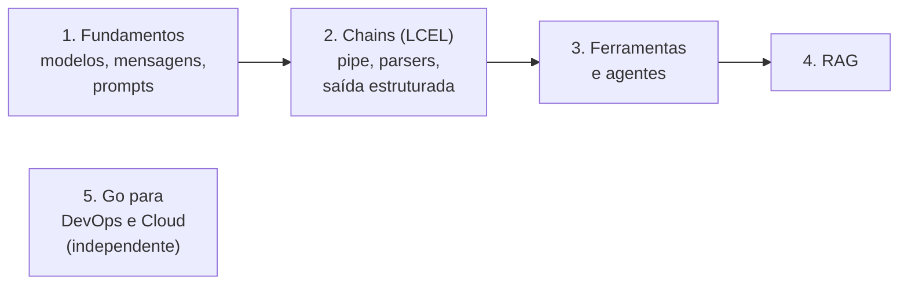

<!-- TOC -->

- [learning-langchain](#learning-langchain)
  - [O que é](#o-que-é)
  - [Comece em 5 minutos](#comece-em-5-minutos)
  - [A trilha](#a-trilha)
  - [Como o repositório funciona](#como-o-repositório-funciona)
  - [Testes](#testes)
  - [Estrutura do repositório](#estrutura-do-repositório)
  - [Documentação](#documentação)
  - [Contribuindo](#contribuindo)
  - [Recursos para aprender LangChain](#recursos-para-aprender-langchain)
  - [Desenvolvedor](#desenvolvedor)
  - [Licença](#licença)

<!-- TOC -->

# learning-langchain

## O que é

Um repositório de estudo, **para iniciantes**, de
[LangChain](https://docs.langchain.com/oss/python/langchain/overview) com
Python - do primeiro `invoke()` a agentes com ferramentas, memória e RAG -
mais um módulo de **Go para o dia a dia de quem trabalha com infraestrutura**
(DevOps Engineer / Cloud Architect).

- Documentação em **pt-BR**; código e comentários em **en-US**.
- Cada conceito tem explicação, **analogia**, diagrama, exemplo de código
  executável e **testes automatizados**.
- Tudo funciona **sem chave de API e sem custo** no modo offline
  (`LLM_PROVIDER=fake`), usando o modelo falso do próprio LangChain.
- Versões mais recentes em outubro de 2026: LangChain 1.4, Python 3.14,
  Go 1.27, gerenciados com [uv](https://docs.astral.sh/uv/) e
  [mise](https://mise.jdx.dev).
- Ubuntu 22.04/24.04/26.04 (amd64), macOS 13+ (arm64 e amd64) e Windows via
  WSL2.

O conteúdo segue a documentação oficial; versões e nomes de modelos foram
conferidos no momento da escrita e são citados com a data
([`REQUIREMENTS.md`, seção 3](REQUIREMENTS.md#3-software)).

## Comece em 5 minutos

```bash
git clone https://github.com/aeciopires/learning-langchain.git
cd learning-langchain

make check                     # OS + tools (REQUIREMENTS.md, section 3.4)
mise trust && mise install     # Python 3.14, uv, Go 1.27
uv sync                        # Python dependencies into .venv/
cp .env.example .env           # then add GOOGLE_API_KEY (or use the fake provider)

make run-offline               # every example, offline: no API key, no cost
make test                      # every unit test
uv run python 1-fundamentals/1-hello-world.py   # first script with a real model
```

O passo a passo completo, com Ubuntu e macOS, está em
[`REQUIREMENTS.md`, seção 0](REQUIREMENTS.md#0-do-zero-ao-primeiro-script-em-ordem).

## A trilha



| Módulo | Você aprende | Scripts |
|---|---|---|
| [1 - Fundamentos](1-fundamentals/README.md) | `init_chat_model`, mensagens e papéis, `PromptTemplate`, `ChatPromptTemplate`, `invoke`/`stream`/`batch` | 6 |
| [2 - Chains e processos](2-chains-and-process/README.md) | LCEL (`\|`), `RunnableLambda`, `@chain`, output parsers, saída estruturada com Pydantic, `RunnableParallel`, map-reduce | 8 |
| [3 - Ferramentas e agentes](3-tools-and-agents/README.md) | `@tool`, `create_agent`, memória com `InMemorySaver`, um agente revisor de código | 4 |
| [4 - RAG](4-rag/README.md) | `Document`, text splitters, embeddings, `InMemoryVectorStore`, retriever, RAG como chain e como agente | 4 |
| [5 - Go para DevOps e Cloud](5-golang-for-devops/README.md) | goroutines, `context`, `net/http`, `crypto/tls`, JSON, testes com `httptest`, compilação cruzada - em 5 ferramentas de plantão | 5 comandos |

Detalhes e ordem sugerida: [`docs/LEARNING-PATH.md`](docs/LEARNING-PATH.md).

## Como o repositório funciona

Todo script de LangChain pede o modelo a `get_chat_model()`
([`learning_langchain/models.py`](learning_langchain/models.py)), que lê
`LLM_PROVIDER` no `.env`:

| `LLM_PROVIDER` | Modelo usado | Precisa de |
|---|---|---|
| `google_genai` (padrão) | Gemini via `init_chat_model("google_genai:gemini-3.7-flash")` | `GOOGLE_API_KEY` |
| `openai` | GPT via `init_chat_model("openai:gpt-5-nano")` | `OPENAI_API_KEY` |
| `fake` | modelo falso do LangChain com respostas pré-definidas | nada |

> **Analogia:** o modo `fake` é um **simulador de voo**: os mesmos
> instrumentos e procedimentos (as mesmas chains, agentes e ferramentas),
> mas com a paisagem gravada (as respostas do modelo).

Mais em [`docs/ARCHITECTURE.md`](docs/ARCHITECTURE.md).

## Testes

```bash
make test        # uv run pytest -q        - Python, offline, ~2 s
make coverage    # with coverage (minimum 80%)
make go-test     # go test -race -cover ./... in 5-golang-for-devops
make ci          # lint + typecheck + tests (Python and Go)
```

Como testar código que usa LLM sem chamar o LLM - modelo falso, `tool_calls`
roteirizados, modelo "eco" para inspecionar prompts - está em
[`docs/TESTING.md`](docs/TESTING.md).

## Estrutura do repositório

```
.
├── 1-fundamentals/            # chat models, messages, prompt templates, stream/batch
├── 2-chains-and-process/      # LCEL chains, parsers, structured output, parallel, map-reduce
├── 3-tools-and-agents/        # @tool, create_agent, memory, code review agent
├── 4-rag/                     # documents, splitters, embeddings, vector store, RAG
│   └── data/runbooks/         # fictional runbooks used as the knowledge base
├── 5-golang-for-devops/       # Go module: healthcheck, portcheck, certcheck, logstats, envcheck
├── learning_langchain/        # shared helpers: config, models (incl. offline fake), cli, rag
├── tests/                     # pytest unit tests (offline)
├── docs/                      # learning path, concepts, architecture, testing, troubleshooting
├── scripts/check-deps.sh      # `make check`
├── Makefile                   # shortcuts - REQUIREMENTS.md, section 6
├── pyproject.toml / uv.lock   # Python dependencies (uv)
├── requirements.txt           # generated from uv.lock, for pip users
├── .python-version            # 3.14
├── mise.toml                  # Python, uv and Go versions
├── .env.example               # configuration template (copy to .env)
├── CHANGELOG.md, CONTRIBUTING.md, CLAUDE.md, REQUIREMENTS.md, LICENSE
└── README.md
```

Cada diretório numerado tem um `README.md` com visão geral, conceitos com
analogias, diagramas, como executar, exemplos, testes, erros comuns e
referências oficiais.

## Documentação

| Documento | Conteúdo |
|---|---|
| [`REQUIREMENTS.md`](REQUIREMENTS.md) | SOs suportados, instalação (Ubuntu/macOS), mise, uv, `.env`, atalhos do Makefile |
| [`docs/LEARNING-PATH.md`](docs/LEARNING-PATH.md) | a trilha completa e os próximos passos |
| [`docs/CONCEPTS.md`](docs/CONCEPTS.md) | glossário com analogias |
| [`docs/ARCHITECTURE.md`](docs/ARCHITECTURE.md) | como scripts, pacote e testes se encaixam |
| [`docs/TESTING.md`](docs/TESTING.md) | como os testes funcionam e como escrever um |
| [`docs/TROUBLESHOOTING.md`](docs/TROUBLESHOOTING.md) | sintomas -> causas -> correções |
| [`CHANGELOG.md`](CHANGELOG.md) | histórico de mudanças |

## Contribuindo

Veja [`CONTRIBUTING.md`](CONTRIBUTING.md). Em resumo: siga o padrão dos
módulos, não invente APIs (use fontes oficiais), escreva testes e rode
`make ci` antes do pull request.

## Recursos para aprender LangChain

Repositórios no GitHub:

- https://github.com/langchain-ai/langchain
- https://github.com/langchain-ai/docs (fonte da documentação oficial)
- https://github.com/Nasiko-Labs/nasiko

Sites e blogs:

- https://docs.langchain.com/oss/python/langchain/quickstart
- https://docs.langchain.com/oss/python/langchain/overview
- https://docs.langchain.com/oss/python/learn
- https://www.langchain.com/
- https://docs.smith.langchain.com/
- https://smith.langchain.com/hub/search?organizationId=dda3b4b9-812c-4344-837c-8f72d2e9661d
- https://academy.langchain.com/courses/foundation-introduction-to-langchain-python
- https://academy.langchain.com/courses/langchain-essentials-python
- https://academy.langchain.com/courses/intro-to-langgraph
- https://www.youtube.com/watch?v=J7j5tCB_y4w
- https://pythonacademy.com.br/blog/o-que-e-e-como-funciona-o-langchain
- https://www.udemy.com/course/langchain-desenvolva-agentes-e-aplicacoes-ia-com-llms
- https://blog.jetbrains.com/pycharm/2026/02/langchain-tutorial-2026/
- https://latenode.com/blog/ai-frameworks-technical-infrastructure/langchain-setup-tools-agents-memory/langchain-python-tutorial-complete-beginners-guide-to-getting-started
- https://ricardo-reis.medium.com/langchain-guia-de-in%C3%ADcio-r%C3%A1pido-138284ec8681
- https://www.datacamp.com/tutorial/building-langchain-agents-to-automate-tasks-in-python

> Conteúdo de terceiros (blogs, cursos, vídeos) pode usar APIs anteriores ao
> LangChain 1.0. Em caso de dúvida, a documentação oficial é a referência.

Go:

- https://go.dev/tour/
- https://go.dev/doc/effective_go
- https://go.dev/doc/

Ferramentas e agentes de IA:

- https://www.promptingguide.ai/
- https://docs.anthropic.com/en/docs/claude-code/skills
- https://docs.anthropic.com/en/docs/claude-code/overview
- https://resources.anthropic.com/hubfs/The-Complete-Guide-to-Building-Skill-for-Claude.pdf
- https://claude.com/blog/equipping-agents-for-the-real-world-with-agent-skills
- https://www.skills.sh/
- https://mcpserverhub.com/
- https://mcp-catalog.com/
- https://hub.docker.com/mcp

## Desenvolvedor

Aecio dos Santos Pires

- LinkedIn: https://www.linkedin.com/in/aeciopires/
- Site: http://aeciopires.com/

## Licença

GNU General Public License v3.0 - veja [`LICENSE`](LICENSE).
