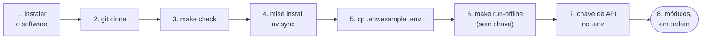

<!-- TOC -->

- [Requisitos](#requisitos)
  - [0. Do zero ao primeiro script, em ordem](#0-do-zero-ao-primeiro-script-em-ordem)
  - [1. Sistemas operacionais suportados](#1-sistemas-operacionais-suportados)
  - [2. Hardware recomendado](#2-hardware-recomendado)
  - [3. Software](#3-software)
    - [3.1 - Instalação no Ubuntu (amd64)](#31---instalação-no-ubuntu-amd64)
    - [3.2 - Instalação no macOS (arm64 e amd64)](#32---instalação-no-macos-arm64-e-amd64)
    - [3.3 - Gerenciando versões com mise](#33---gerenciando-versões-com-mise)
    - [3.4 - Executando e lendo o `make check`](#34---executando-e-lendo-o-make-check)
    - [3.5 - Editor (opcional)](#35---editor-opcional)
  - [4. Preparando o projeto com uv](#4-preparando-o-projeto-com-uv)
    - [4.1 - Alternativa: pip e `requirements.txt`](#41---alternativa-pip-e-requirementstxt)
  - [5. Chaves de API e o arquivo `.env`](#5-chaves-de-api-e-o-arquivo-env)
    - [5.1 - Variáveis de configuração](#51---variáveis-de-configuração)
    - [5.2 - Modo offline (`LLM_PROVIDER=fake`)](#52---modo-offline-llm_providerfake)
    - [5.3 - Custos e cotas](#53---custos-e-cotas)
  - [6. Atalhos do Makefile](#6-atalhos-do-makefile)
  - [7. Referências](#7-referências)

<!-- TOC -->

# Requisitos

Este documento lista o software e o hardware necessários para seguir a
trilha de [`docs/LEARNING-PATH.md`](docs/LEARNING-PATH.md). **Nunca usou
uv, mise ou LangChain? Comece pela seção 0** - o resto é material de
consulta.

## 0. Do zero ao primeiro script, em ordem

Alguns conceitos antes:

- **LangChain** é uma biblioteca Python para construir aplicações com
  modelos de linguagem (LLMs): conversar com o modelo, montar *chains*,
  dar ferramentas a agentes, consultar documentos (RAG).
- **uv** instala as dependências Python deste projeto em uma pasta privada
  (`.venv/`), na versão exata registrada em `uv.lock`.
- **mise** instala as versões certas das ferramentas (Python, uv e Go)
  listadas em [`mise.toml`](mise.toml).
- **Chave de API**: a "senha" que permite chamar o modelo do Google
  (Gemini) ou da OpenAI. Sem chave, use o modo offline
  ([seção 5.2](#52---modo-offline-llm_providerfake)).



1. **Instale o software** da [seção 3](#3-software)
   ([3.1](#31---instalação-no-ubuntu-amd64) Ubuntu, [3.2](#32---instalação-no-macos-arm64-e-amd64) macOS).
2. **Baixe o código**:
   ```bash
   git clone https://github.com/aeciopires/learning-langchain.git
   cd learning-langchain
   ```
3. **Confira a sua máquina** ([seção 3.4](#34---executando-e-lendo-o-make-check)):
   ```bash
   make check
   ```
4. **Instale as ferramentas e as dependências** ([seções 3.3](#33---gerenciando-versões-com-mise) e [4](#4-preparando-o-projeto-com-uv)):
   ```bash
   mise trust && mise install   # Python 3.14, uv, Go 1.27
   uv sync                      # .venv/ with LangChain and the dev tools
   ```
5. **Crie o seu `.env`** ([seção 5](#5-chaves-de-api-e-o-arquivo-env)):
   ```bash
   cp .env.example .env
   ```
6. **Rode tudo sem chave e sem custo** - prova de que a instalação funciona:
   ```bash
   make run-offline   # every script with LLM_PROVIDER=fake
   make test          # every unit test
   ```
7. **Coloque a sua chave de API** no `.env` (`GOOGLE_API_KEY`, ou
   `OPENAI_API_KEY` com `LLM_PROVIDER=openai`).
8. **Siga os módulos em ordem**, começando por
   [`1-fundamentals/README.md`](1-fundamentals/README.md) - veja
   [`docs/LEARNING-PATH.md`](docs/LEARNING-PATH.md).

Se algo falhar, rode `make check` de novo, leia a mensagem de erro e
consulte [`docs/TROUBLESHOOTING.md`](docs/TROUBLESHOOTING.md).

## 1. Sistemas operacionais suportados

| Sistema | Arquitetura | Situação |
|---|---|---|
| Ubuntu 22.04 / 24.04 / 26.04 LTS | `amd64` (`x86_64`) | Suportado |
| macOS 13+ | `arm64` (Apple Silicon) e `amd64` (Intel) | Suportado |
| Windows | - | Não suportado diretamente - use o WSL2 com Ubuntu |

O código é Python puro e Go com biblioteca padrão; uv, mise, Python e Go
têm versões para `amd64` e `arm64`. No Windows, instale o
[WSL2](https://learn.microsoft.com/windows/wsl/install) com uma distribuição
Ubuntu e siga a [seção 3.1](#31---instalação-no-ubuntu-amd64) dentro dele.
(Os binários Go do módulo 5 podem ser compilados para Windows com
`make go-cross`.)

## 2. Hardware recomendado

| Recurso | Mínimo | Confortável | Observação |
|---|---|---|---|
| RAM livre | 2 GB | 4 GB | os modelos rodam na nuvem do provedor, não na sua máquina |
| Disco livre | 2 GB | 4 GB | `.venv/` com as dependências, Python e Go instalados pelo mise |
| Rede | - | - | acesso ao PyPI no primeiro `uv sync` e à API do provedor (Google ou OpenAI) ao rodar os scripts; o modo `fake` e os testes não usam a rede |

## 3. Software

Rode `make check` ([seção 3.4](#34---executando-e-lendo-o-make-check)) para
ver o que falta.

| Software | Versão recomendada | Obrigatório? | Para quê |
|---|---|---|---|
| [uv](https://docs.astral.sh/uv/) | 0.12 | sim | dependências Python - [seção 4](#4-preparando-o-projeto-com-uv) |
| Python | 3.14 | sim | fixado em `.python-version` e `mise.toml`; o `uv` baixa sozinho se não encontrar |
| [mise](https://mise.jdx.dev) | mais recente | recomendado | instala as versões fixadas de Python, uv e Go - [seção 3.3](#33---gerenciando-versões-com-mise) |
| [Go](https://go.dev) | 1.27 | só para o módulo 5 | fixado em `mise.toml` e `5-golang-for-devops/go.mod` |
| git | 2.x | sim | clonar o repositório |
| make | qualquer | sim | os atalhos do [`Makefile`](Makefile) - [seção 6](#6-atalhos-do-makefile) |
| curl | qualquer | sim | instalar uv e mise |

> **Guardrail:** as versões fixadas - LangChain 1.4.3, `langchain-core`
> 1.6.6, `langchain-google-genai` 4.4.0, `langchain-openai` 1.6.7 em
> [`pyproject.toml`](pyproject.toml), Python 3.14, Go 1.27 e os nomes de
> modelos padrão (`gemini-3.7-flash`, `gpt-5-nano`) - eram as mais recentes
> **em outubro de 2026**, quando este material foi escrito. Elas mudam com
> frequência: confira o [PyPI](https://pypi.org/project/langchain/), as
> [versões do Go](https://go.dev/dl/) e a lista de modelos de cada provedor
> antes de confiar nelas.

### 3.1 - Instalação no Ubuntu (amd64)

```bash
# git, make, curl
sudo apt-get update && sudo apt-get install -y git make curl

# uv (official installer)
curl -LsSf https://astral.sh/uv/install.sh | sh

# mise (recommended - section 3.3)
curl https://mise.run | sh
echo 'eval "$(~/.local/bin/mise activate bash)"' >> ~/.bashrc   # Bash; other shells: section 3.3

# open a new terminal, then, from this repository's root:
mise trust && mise install   # Python 3.14, uv 0.12, Go 1.27 (mise.toml)
```

### 3.2 - Instalação no macOS (arm64 e amd64)

```bash
# Xcode Command Line Tools: git and make
xcode-select --install

# uv and mise with Homebrew (https://brew.sh)
brew install uv mise
echo 'eval "$(mise activate zsh)"' >> ~/.zshrc   # Zsh (macOS default shell)
```

Abra um novo terminal e, na raiz do repositório:

```bash
mise trust && mise install   # Python 3.14, uv 0.12, Go 1.27 (mise.toml)
```

O `make` do macOS e o `/bin/bash` 3.2 funcionam com o `Makefile` e com
`scripts/check-deps.sh` (escritos sem recursos exclusivos do GNU).

### 3.3 - Gerenciando versões com mise

O [mise](https://mise.jdx.dev) instala versões exatas de ferramentas por
projeto e troca para elas quando você entra no diretório. Este repositório
fixa três em [`mise.toml`](mise.toml):

```toml
[tools]
python = "3.14"
uv = "0.12"
go = "1.27"
```

`"3.14"` significa "a versão 3.14.x mais recente" (o mesmo vale para as
outras). Ative o mise no seu shell uma vez por máquina (da documentação do
[`mise activate`](https://mise.jdx.dev/cli/activate.html)):

| Shell | Arquivo | Linha a adicionar |
|---|---|---|
| Bash | `~/.bashrc` | `eval "$(mise activate bash)"` |
| Zsh | `~/.zshrc` | `eval "$(mise activate zsh)"` |
| Fish | `~/.config/fish/config.fish` | `mise activate fish \| source` |

Depois, `mise trust && mise install` no repositório, e confira com
`mise ls`, `python --version`, `uv --version` e `go version`. Sem ativação
(scripts, CI), prefixe os comandos com `mise exec --`.

O mise é recomendado, não obrigatório: o `uv` baixa o Python sozinho
([documentação do uv](https://docs.astral.sh/uv/concepts/python-versions/)),
e o Go 1.21+ baixa a versão pedida pelo `go.mod` com o padrão
`GOTOOLCHAIN=auto` ([*Go Toolchains*](https://go.dev/doc/toolchain)).

### 3.4 - Executando e lendo o `make check`

```bash
make check
```

executa [`scripts/check-deps.sh`](scripts/check-deps.sh), que confere o
sistema operacional ([seção 1](#1-sistemas-operacionais-suportados)), cada
ferramenta da [seção 3](#3-software) e o seu `.env`
([seção 5](#5-chaves-de-api-e-o-arquivo-env)), uma linha por item:

| Marcador | Significado |
|---|---|
| `[ OK ]` | encontrado e na versão recomendada |
| `[WARN]` | ferramenta recomendada/opcional ausente, versão mais antiga que a recomendada ou `.env` incompleto |
| `[FAIL]` | algo obrigatório falta - corrija antes de continuar |

Ele termina com código `0` quando nada obrigatório falhou e nunca instala
nada. Exemplo (Ubuntu 24.04 com Python e Go do sistema mais antigos):

```
== Operating system (REQUIREMENTS.md section 1) ==
  [ OK ] Ubuntu 24.04 (x86_64) - supported

== Required software (REQUIREMENTS.md section 3) ==
  [ OK ] uv 0.8.17 found
  [WARN] Python 3.11.15 found, but this repository pins 3.14 - run 'mise install', or let 'uv sync' download 3.14 itself (REQUIREMENTS.md sections 3.3 and 4).
  ...
```

### 3.5 - Editor (opcional)

Use o editor que preferir. O [VS Code](https://code.visualstudio.com) com
estas extensões ajuda a editar e revisar o conteúdo:

- Python: https://marketplace.visualstudio.com/items?itemName=ms-python.python
- Go: https://marketplace.visualstudio.com/items?itemName=golang.go
- Ruff: https://marketplace.visualstudio.com/items?itemName=charliermarsh.ruff
- Markdown All in One: https://marketplace.visualstudio.com/items?itemName=yzhang.markdown-all-in-one
- markdownlint: https://marketplace.visualstudio.com/items?itemName=DavidAnson.vscode-markdownlint
- GitLens: https://marketplace.visualstudio.com/items?itemName=eamodio.gitlens
- YAML: https://marketplace.visualstudio.com/items?itemName=redhat.vscode-yaml

## 4. Preparando o projeto com uv

```bash
uv sync                                                     # creates .venv/ from uv.lock (+ dev tools)
uv run python --version                                     # Python 3.14.x
LLM_PROVIDER=fake uv run python 1-fundamentals/1-hello-world.py   # first script, offline
```

- [`pyproject.toml`](pyproject.toml) declara as dependências (versões
  fixadas) e o grupo `dev` (pytest, pytest-cov, ruff, mypy).
- [`uv.lock`](uv.lock) registra a versão exata de **todas** as dependências,
  inclusive as indiretas - todo mundo instala o mesmo conjunto.
- `uv sync` também instala o pacote local
  [`learning_langchain/`](learning_langchain/) (os *helpers* usados pelos
  scripts) em modo editável.
- `uv run <comando>` executa o comando dentro do `.venv/`, sem precisar de
  `source .venv/bin/activate`.

Para atualizar uma dependência: altere a versão em `pyproject.toml`, rode
`uv lock` e `uv sync`, depois `make ci` e `make requirements`.

### 4.1 - Alternativa: pip e `requirements.txt`

Para quem prefere `pip`, [`requirements.txt`](requirements.txt) é gerado a
partir do `uv.lock` (`make requirements`, que roda `uv export`) e inclui o
pacote local (`-e .`):

```bash
python --version            # must be 3.14 (e.g. installed by `mise install`)
python -m venv .venv
source .venv/bin/activate
pip install -r requirements.txt
python 1-fundamentals/1-hello-world.py
```

Ele não inclui as ferramentas de desenvolvimento (pytest, ruff, mypy); para
os testes, prefira o `uv`.

## 5. Chaves de API e o arquivo `.env`

```bash
cp .env.example .env
```

Todos os scripts chamam `load_dotenv()` (pacote `python-dotenv`), que lê o
`.env`. Variáveis já definidas no shell **têm prioridade** sobre o `.env`,
por isso `LLM_PROVIDER=fake make run-all` funciona mesmo com outro valor no
arquivo. O `.env` está no `.gitignore` - nunca faça commit de chaves.

| Provedor | Como obter a chave | Variável |
|---|---|---|
| Google (Gemini) - padrão | [Google AI Studio](https://ai.google.dev/gemini-api/docs/api-key) | `GOOGLE_API_KEY` (a integração também aceita `GEMINI_API_KEY`) |
| OpenAI | [OpenAI API keys](https://platform.openai.com/api-keys) | `OPENAI_API_KEY` |

### 5.1 - Variáveis de configuração

Lidas por [`learning_langchain/config.py`](learning_langchain/config.py) e
validadas na hora, com uma mensagem que cita a variável:

| Variável | Padrão | Efeito |
|---|---|---|
| `LLM_PROVIDER` | `google_genai` | `google_genai`, `openai` ou `fake`; outro valor gera `ValueError` |
| `LLM_MODEL` | `gemini-3.7-flash` / `gpt-5-nano` / `fake-chat-model` | modelo de chat do provedor escolhido |
| `LLM_EMBEDDING_MODEL` | `models/gemini-embedding-001` / `text-embedding-3-large` | modelo de embeddings (módulo 4) |
| `LLM_TEMPERATURE` | `0.5` | número entre 0 e 2 (veja a nota sobre `gpt-5` no [módulo 1](1-fundamentals/README.md#temperatura)) |
| `GOOGLE_API_KEY` | - | chave do Gemini |
| `OPENAI_API_KEY` | - | chave da OpenAI |

Os nomes de modelo padrão são os usados nos exemplos da documentação oficial
do LangChain em outubro de 2026. Modelos são lançados e aposentados com
frequência: se o provedor disser que o modelo não existe, defina
`LLM_MODEL`. O script `3-tools-and-agents/4-agent-review.py` lista os
modelos Gemini disponíveis para a sua chave.

### 5.2 - Modo offline (`LLM_PROVIDER=fake`)

Com `LLM_PROVIDER=fake`, os scripts usam o modelo falso do próprio LangChain
(`GenericFakeChatModel`, de `langchain_core`) com respostas pré-definidas em
cada script, e embeddings falsos (`DeterministicFakeEmbedding`). Nada sai
da sua máquina e não há custo.

> **Analogia:** é o **simulador de voo**. Os instrumentos, os botões e os
> procedimentos são os mesmos do avião de verdade (as mesmas chains, os
> mesmos agentes, as ferramentas executam de verdade), mas a paisagem lá
> fora é gravada (as respostas do modelo).

Use para: conferir a instalação, estudar o fluxo do código sem custo, e nos
testes automatizados. Não use para avaliar a qualidade das respostas.

### 5.3 - Custos e cotas

Chamadas a provedores reais podem ser cobradas e têm limites de uso
(*rate limits*). Confira os preços e cotas atuais nas páginas oficiais de
[preços do Gemini](https://ai.google.dev/gemini-api/docs/pricing) e de
[preços da OpenAI](https://openai.com/api/pricing/). `make run-all`
executa **todos** os scripts com o provedor do seu `.env` - prefira
`make run-module` ou `make run-offline` enquanto estuda.

## 6. Atalhos do Makefile

Aprenda primeiro a forma longa (os READMEs usam ela); depois os targets do
[`Makefile`](Makefile) economizam digitação. `make` (ou `make help`) lista
todos.

| Target | O que faz | Forma longa |
|---|---|---|
| `make check` | confere SO, ferramentas e `.env` | `bash scripts/check-deps.sh` |
| `make sync` | cria o `.venv/` | `uv sync` |
| `make run SCRIPT=1-fundamentals/1-hello-world.py` | roda um script | `uv run python 1-fundamentals/1-hello-world.py` |
| `make run-module MODULE=4-rag` | roda os scripts de um módulo, em ordem | um `uv run python ...` por script |
| `make run-all` | roda todos os scripts Python, em ordem (custa chamadas de API) | idem, para os 4 módulos |
| `make run-offline` | `run-all` com `LLM_PROVIDER=fake` | `LLM_PROVIDER=fake make run-all` |
| `make test` | testes Python (offline) | `uv run pytest -q` |
| `make coverage` | testes + cobertura (falha abaixo de 80%) | `uv run pytest --cov` |
| `make lint` / `make format` | ruff (verifica / corrige) | `uv run ruff check .` e `uv run ruff format .` |
| `make typecheck` | mypy no pacote, nos testes e em cada script | `uv run mypy ...` |
| `make go-test` / `go-vet` / `go-fmt` | testes e checagens do módulo Go | `cd 5-golang-for-devops && go test -race -cover ./...` |
| `make go-build` / `go-cross` | compila o módulo Go (local / várias plataformas) | `go build -o bin/ ./cmd/...` |
| `make ci` | tudo que um pull request precisa passar | `lint typecheck test go-fmt go-vet go-test` |
| `make requirements` | regenera `requirements.txt` | `uv export --format requirements.txt --no-hashes --no-dev -o requirements.txt` |
| `make clean` | apaga caches, relatórios e binários Go | - |

Nos targets `run*`, cada script roda sem `stdin` (`< /dev/null`): toda
pergunta interativa recebe o valor padrão, e nada fica esperando você.

## 7. Referências

- [LangChain - Install](https://docs.langchain.com/oss/python/langchain/install)
- [LangChain - Quickstart](https://docs.langchain.com/oss/python/langchain/quickstart)
- [uv - Installation](https://docs.astral.sh/uv/getting-started/installation/)
- [uv - Locking and syncing (`uv export`)](https://docs.astral.sh/uv/concepts/projects/sync/)
- [mise - Installing mise](https://mise.jdx.dev/installing-mise.html) e [Getting started](https://mise.jdx.dev/getting-started.html)
- [Go - Download and install](https://go.dev/doc/install)
- [Gemini API - API keys](https://ai.google.dev/gemini-api/docs/api-key)
- [OpenAI - Quickstart](https://platform.openai.com/docs/quickstart)
- [WSL - Install](https://learn.microsoft.com/windows/wsl/install)
