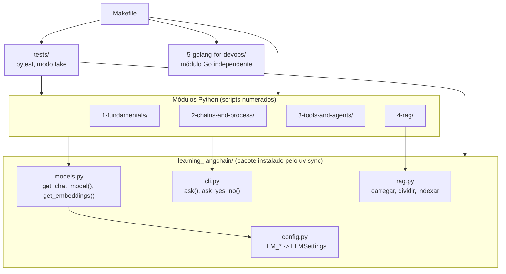
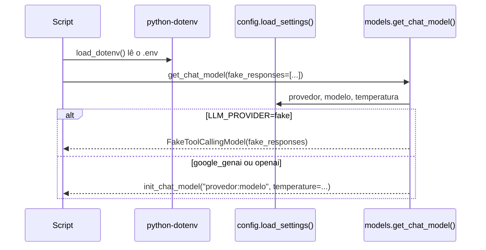

<!-- TOC -->

- [Arquitetura do repositório](#arquitetura-do-repositório)
  - [Visão geral](#visão-geral)
  - [O pacote `learning_langchain/`](#o-pacote-learning_langchain)
  - [Como um script escolhe o modelo](#como-um-script-escolhe-o-modelo)
  - [O contrato de cada script](#o-contrato-de-cada-script)
  - [Como os testes enxergam os scripts](#como-os-testes-enxergam-os-scripts)
  - [Ferramentas do projeto](#ferramentas-do-projeto)

<!-- TOC -->

# Arquitetura do repositório

## Visão geral

## O pacote `learning_langchain/`

Os scripts ficam pequenos e focados no conceito que ensinam; as partes
repetidas ficam no pacote:

| Arquivo | Responsabilidade |
|---|---|
| [`config.py`](../learning_langchain/config.py) | lê e valida `LLM_PROVIDER`, `LLM_MODEL`, `LLM_EMBEDDING_MODEL`, `LLM_TEMPERATURE` |
| [`models.py`](../learning_langchain/models.py) | `get_chat_model()` (`init_chat_model()` ou modelo falso), `get_embeddings()`, `FakeToolCallingModel` |
| [`cli.py`](../learning_langchain/cli.py) | o padrão "ENTER = padrão" para scripts interativos, inclusive sem `stdin` |
| [`rag.py`](../learning_langchain/rag.py) | funções de RAG reutilizadas pelos scripts 2-4 do módulo 4 |

`pyproject.toml` declara o pacote (`[tool.hatch.build.targets.wheel]`), e
o `uv sync` o instala em modo editável - por isso
`from learning_langchain.models import get_chat_model` funciona em qualquer
script executado com `uv run`.

## Como um script escolhe o modelo

Cada script passa as suas próprias respostas falsas (`fake_responses`) -
inclusive `AIMessage` com `tool_calls` nos agentes - para que o modo
offline percorra o mesmo caminho que um modelo real percorreria.

## O contrato de cada script

1. Docstring do módulo com o objetivo e o comando para rodar.
2. `load_dotenv()` logo após os imports (quando usa um modelo).
3. Funções que **constroem** as peças e recebem o modelo como argumento
   (`build_chain(model)`, `build_agent(model)`, `build_pipeline(model)`) -
   é isso que os testes usam.
4. `main()` com a parte interativa e as impressões.
5. `if __name__ == "__main__": main()` - importar o script nos testes não
   executa nada.
6. Perguntas interativas com `learning_langchain.cli.ask()`: ENTER, ou a
   ausência de `stdin`, usa o padrão.

## Como os testes enxergam os scripts

Diretórios como `2-chains-and-process` e arquivos como
`3-runnable-lambda.py` não são nomes válidos de módulo Python
(`import 2-chains...` é erro de sintaxe). `tests/_helpers.py:load_script()`
importa o arquivo pelo caminho com `importlib`. Veja
[`TESTING.md`](TESTING.md).

## Ferramentas do projeto

| Arquivo | Papel |
|---|---|
| [`pyproject.toml`](../pyproject.toml) | dependências fixadas, grupo `dev`, configuração de ruff, mypy, pytest e coverage |
| [`uv.lock`](../uv.lock) | versões exatas de todas as dependências |
| [`.python-version`](../.python-version) | Python 3.14 (lido pelo uv e pelo mise) |
| [`mise.toml`](../mise.toml) | Python, uv e Go fixados |
| [`Makefile`](../Makefile) | atalhos ([`REQUIREMENTS.md`, seção 6](../REQUIREMENTS.md#6-atalhos-do-makefile)) |
| [`scripts/check-deps.sh`](../scripts/check-deps.sh) | `make check` |
| [`requirements.txt`](../requirements.txt) | gerado do `uv.lock`, para quem usa `pip` |
| [`.env.example`](../.env.example) | modelo do `.env` |
