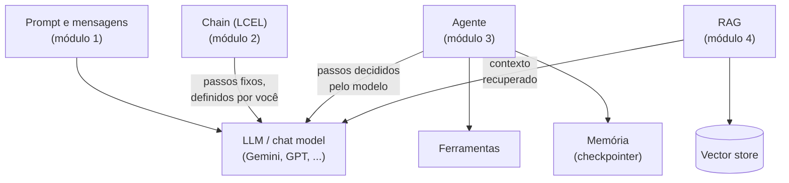

<!-- TOC -->

- [Conceitos e glossário](#conceitos-e-glossário)
  - [O mapa em uma imagem](#o-mapa-em-uma-imagem)
  - [IA generativa](#ia-generativa)
  - [LangChain e o ecossistema](#langchain-e-o-ecossistema)
  - [Peças do LangChain](#peças-do-langchain)
  - [Agentes](#agentes)
  - [RAG](#rag)
  - [Testes](#testes)
  - [Referências](#referências)

<!-- TOC -->

# Conceitos e glossário

Os termos que aparecem na trilha, em ordem de "do mais geral ao mais
específico", cada um com uma analogia. Os módulos explicam cada conceito em
detalhe, com código; aqui está a visão de conjunto.

## O mapa em uma imagem

## IA generativa

| Termo | O que é | Analogia |
|---|---|---|
| **LLM** (*Large Language Model*) | modelo treinado em grandes volumes de texto que gera texto continuando uma entrada | um **leitor voraz** que leu uma biblioteca inteira e responde com base no que lembra - inclusive quando lembra errado |
| **Chat model** | LLM com interface de conversa: recebe uma lista de mensagens e devolve uma mensagem | um atendente que lê o histórico do chamado antes de responder |
| **Prompt** | a entrada enviada ao modelo | o **briefing** que você entrega a um profissional terceirizado |
| **System prompt** | instrução geral de comportamento, enviada antes da conversa | o **treinamento** que o atendente recebeu antes do turno |
| **Token** | pedaço de texto (parte de uma palavra, uma palavra, pontuação) que o modelo processa; provedores cobram e limitam por tokens | as **fichas** de um fliperama: cada pergunta e cada resposta consome fichas |
| **Janela de contexto** | quantidade máxima de tokens que o modelo considera de uma vez | o tamanho da **mesa de trabalho**: o que não cabe nela fica fora da vista |
| **Temperatura** | controla a aleatoriedade da escolha das palavras | um **botão de criatividade**: baixo = previsível, alto = variado |
| **Alucinação** | resposta fluente, mas falsa ou inventada | um aluno que **chuta com confiança** na prova |
| **Embedding** | vetor de números que representa o significado de um texto | **coordenadas de GPS** de um significado: textos parecidos ficam perto |

## LangChain e o ecossistema

| Termo | O que é | Analogia |
|---|---|---|
| **LangChain** | biblioteca para construir aplicações e agentes com LLMs, com interfaces padrão para modelos, ferramentas e dados; oferece `create_agent` | uma **caixa de ferramentas padronizada**: as peças encaixam entre si, de qualquer fabricante |
| **LangGraph** | *framework* de orquestração de baixo nível do mesmo time; `create_agent` roda sobre ele | o **trilho** por onde o trem (o agente) anda |
| **LangSmith** | plataforma para rastrear, depurar e avaliar aplicações e agentes | a **caixa-preta** do avião, mais o painel de manutenção |
| **Integração / provedor** | pacote que liga o LangChain a um serviço (`langchain-google-genai`, `langchain-openai`) | o **adaptador de tomada** de cada país |

> A documentação oficial resume a relação: use o LangChain (`create_agent`)
> para um agente altamente customizável e o LangGraph para necessidades
> avançadas que combinam fluxos determinísticos e agênticos.

## Peças do LangChain

| Termo | Onde aparece | Analogia |
|---|---|---|
| **Message** (`SystemMessage`, `HumanMessage`, `AIMessage`, `ToolMessage`) | módulo 1 | as **falas de um roteiro**, cada uma com o nome de quem fala |
| **Prompt template** | módulo 1 | uma **carta modelo** com campos a preencher |
| **Runnable** | módulo 2 | uma **peça de Lego** com o mesmo encaixe (`invoke`, `stream`, `batch`) |
| **LCEL** / operador `\|` | módulo 2 | o **pipe** do Linux: `cat \| grep \| wc` |
| **Output parser** | módulo 2 | um **tradutor** do formato do modelo para o formato do seu código |
| **Structured output** | módulo 2 | um **formulário** com campos obrigatórios em vez de uma folha em branco |
| **`RunnableParallel`** | módulos 2 e 4 | uma **equipe** fazendo partes da tarefa ao mesmo tempo |

## Agentes

| Termo | O que é | Analogia |
|---|---|---|
| **Tool** (ferramenta) | função que o modelo pode pedir para executar; nome, descrição e argumentos são enviados ao modelo | um **ajudante** de cozinha com uma função clara no crachá |
| **Tool calling** | o modelo responde com o nome da ferramenta e os argumentos (`tool_calls`), em vez de texto; quem executa é o seu programa | o chefe **gritando um pedido** para o ajudante |
| **Agente** | "um modelo chamando ferramentas em um loop até que a tarefa esteja completa" (documentação oficial) | um **técnico de plantão** seguindo um runbook |
| **Checkpointer** | guarda o estado (as mensagens) de cada conversa | um **caderno** com uma página por cliente |
| **Thread** (`thread_id`) | identifica uma conversa no checkpointer | o **número da página** do caderno |

## RAG

| Termo | O que é | Analogia |
|---|---|---|
| **RAG** | recuperar trechos relevantes de documentos e enviá-los ao modelo junto com a pergunta | **prova com consulta** |
| **Document** | texto + metadados | um livro com a sua **ficha catalográfica** |
| **Text splitter / chunk** | divide documentos em pedaços menores | **fatiar o pão** para caber na torradeira |
| **Vector store** | guarda vetores e busca os mais próximos | uma **biblioteca organizada por assunto**, não por ordem alfabética |
| **Retriever** | interface que recebe uma pergunta e devolve documentos | o **bibliotecário** que traz os livros certos |

## Testes

| Termo | O que é | Analogia |
|---|---|---|
| **Fake model** (`GenericFakeChatModel`) | modelo falso com respostas roteirizadas, sem rede | um **ator com o roteiro decorado** |
| **Modo offline** (`LLM_PROVIDER=fake`) | todos os scripts usando o modelo falso | um **simulador de voo** |
| **Teste unitário** | verifica uma parte pequena do código, isolada e de forma determinística | testar **cada peça** do motor na bancada, antes de montar o carro |

## Referências

- [LangChain - Overview](https://docs.langchain.com/oss/python/langchain/overview)
- [LangChain - Philosophy](https://docs.langchain.com/oss/python/langchain/philosophy)
- [LangChain - Component architecture](https://docs.langchain.com/oss/python/langchain/component-architecture)
- [LangGraph - Overview](https://docs.langchain.com/oss/python/langgraph/overview)
- [LangSmith - Observability](https://docs.langchain.com/langsmith/observability)
- [Prompt Engineering Guide](https://www.promptingguide.ai/)
