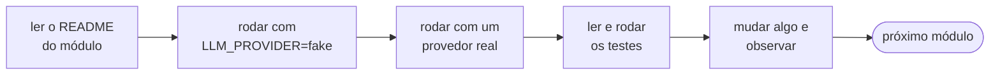
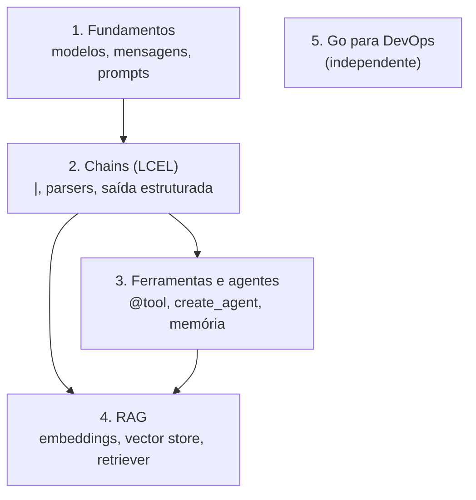

<!-- TOC -->

- [Trilha de aprendizado](#trilha-de-aprendizado)
  - [Como usar esta trilha](#como-usar-esta-trilha)
  - [Mapa da trilha](#mapa-da-trilha)
  - [Módulo 1 - Fundamentos](#módulo-1---fundamentos)
  - [Módulo 2 - Chains e processos (LCEL)](#módulo-2---chains-e-processos-lcel)
  - [Módulo 3 - Ferramentas e agentes](#módulo-3---ferramentas-e-agentes)
  - [Módulo 4 - RAG](#módulo-4---rag)
  - [Módulo 5 - Go para DevOps e Cloud](#módulo-5---go-para-devops-e-cloud)
  - [Guias transversais](#guias-transversais)
  - [Depois desta trilha](#depois-desta-trilha)

<!-- TOC -->

# Trilha de aprendizado

Quatro módulos de LangChain com Python, do primeiro `invoke()` a agentes com
RAG, e um módulo independente de Go para o dia a dia de infraestrutura.
Prepare a sua máquina antes com
[`REQUIREMENTS.md`, seção 0](../REQUIREMENTS.md#0-do-zero-ao-primeiro-script-em-ordem).

## Como usar esta trilha

- **Siga a ordem na primeira vez.** Cada módulo usa o que o anterior ensinou,
  e os scripts dentro de cada módulo são numerados na ordem de leitura.
- **Em cada módulo**: leia o README (visão geral, arquitetura, conceitos),
  rode cada script primeiro com `LLM_PROVIDER=fake` para entender o fluxo
  sem custo, depois com um provedor real, e por fim leia e rode os testes.
- **Mude o código.** Troque o prompt, a temperatura, a ferramenta, o
  documento - e veja o que acontece. Um teste quebrando é um ótimo professor.
- **Não pule os testes.** [`TESTING.md`](TESTING.md) mostra como testar
  código que usa LLM sem chamar o LLM.

O ciclo para repetir em cada módulo:

## Mapa da trilha

Uma seta significa "usa o que você aprendeu em":

## Módulo 1 - Fundamentos

[`1-fundamentals/README.md`](../1-fundamentals/README.md)

| # | Script | Você aprende |
|---|---|---|
| 1 | `1-hello-world.py` | `invoke()` e o conteúdo de uma `AIMessage` |
| 2 | `2-init-chat-model.py` | `init_chat_model()` x classe do provedor |
| 3 | `3-prompt-template.py` | `PromptTemplate` |
| 4 | `4-chat-prompt-template.py` | `ChatPromptTemplate` e papéis |
| 5 | `5-messages.py` | histórico: o modelo não tem memória |
| 6 | `6-streaming-and-batch.py` | `stream()` e `batch()` |

## Módulo 2 - Chains e processos (LCEL)

[`2-chains-and-process/README.md`](../2-chains-and-process/README.md)

| # | Script | Você aprende |
|---|---|---|
| 1 | `1-starting-chain.py` | `prompt \| model` |
| 2 | `2-chains-with-decorators.py` | `@chain` |
| 3 | `3-runnable-lambda.py` | `RunnableLambda` |
| 4 | `4-chain-of-translate.py` | chain reutilizável com variáveis dinâmicas |
| 5 | `5-sumarization-map-reduce-pipeline.py` | map-reduce com LCEL e `set_debug` |
| 6 | `6-output-parsers.py` | output parsers |
| 7 | `7-structured-output.py` | saída estruturada com Pydantic |
| 8 | `8-runnable-parallel.py` | `RunnableParallel` |

## Módulo 3 - Ferramentas e agentes

[`3-tools-and-agents/README.md`](../3-tools-and-agents/README.md)

| # | Script | Você aprende |
|---|---|---|
| 1 | `1-first-tool.py` | `@tool`: nome, descrição e schema |
| 2 | `2-simple-agent.py` | `create_agent` e o loop de ferramentas |
| 3 | `3-agent-with-memory.py` | memória com `InMemorySaver` e `thread_id` |
| 4 | `4-agent-review.py` | um agente revisor de código |

## Módulo 4 - RAG

[`4-rag/README.md`](../4-rag/README.md)

| # | Script | Você aprende |
|---|---|---|
| 1 | `1-documents-and-splitters.py` | `Document` e chunks |
| 2 | `2-embeddings-and-vector-store.py` | embeddings e busca por similaridade |
| 3 | `3-rag-chain.py` | RAG como chain |
| 4 | `4-rag-agent.py` | RAG com agente |

## Módulo 5 - Go para DevOps e Cloud

[`5-golang-for-devops/README.md`](../5-golang-for-devops/README.md) -
independente dos módulos 1-4; pode ser feito a qualquer momento.

| Ferramenta | Você aprende |
|---|---|
| `healthcheck` | `net/http`, goroutines, `sync.WaitGroup`, `context` |
| `portcheck` | `net.Dialer`, timeouts |
| `certcheck` | `crypto/tls`, `x509`, testes com `httptest.NewTLSServer` |
| `logstats` | `bufio`, `encoding/json`, `io.Reader`, `slices` |
| `envcheck` | `os.LookupEnv`, injeção de dependência para testes |

## Guias transversais

| Guia | Conteúdo |
|---|---|
| [`CONCEPTS.md`](CONCEPTS.md) | glossário de LangChain e IA generativa, com analogias |
| [`ARCHITECTURE.md`](ARCHITECTURE.md) | como o pacote `learning_langchain/`, os scripts e os testes se encaixam |
| [`TESTING.md`](TESTING.md) | como testar código com LLM (Python) e ferramentas Go |
| [`TROUBLESHOOTING.md`](TROUBLESHOOTING.md) | sintomas -> causas -> correções |

## Depois desta trilha

Tópicos da documentação oficial que esta trilha não cobre e são bons
próximos passos:

- [Middleware](https://docs.langchain.com/oss/python/langchain/middleware/overview) e [Guardrails](https://docs.langchain.com/oss/python/langchain/guardrails)
- [Human-in-the-loop](https://docs.langchain.com/oss/python/langchain/human-in-the-loop)
- [Long-term memory](https://docs.langchain.com/oss/python/langchain/long-term-memory)
- [MCP (Model Context Protocol)](https://docs.langchain.com/oss/python/langchain/mcp)
- [LangGraph](https://docs.langchain.com/oss/python/langgraph/overview) para fluxos com mais controle
- [LangSmith](https://docs.langchain.com/langsmith/observability) para rastrear e avaliar agentes
- [Cursos gratuitos da LangChain Academy](https://academy.langchain.com/)
