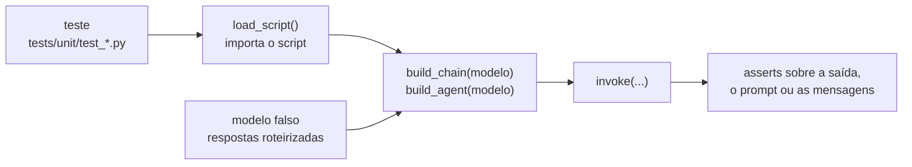

<!-- TOC -->

- [Testes](#testes)
  - [Por que testar código que usa LLM?](#por-que-testar-código-que-usa-llm)
  - [A ideia central: substituir o modelo](#a-ideia-central-substituir-o-modelo)
  - [Executando os testes](#executando-os-testes)
  - [Onde ficam os testes](#onde-ficam-os-testes)
  - [As fixtures e os helpers](#as-fixtures-e-os-helpers)
  - [Caixa de ferramentas](#caixa-de-ferramentas)
    - [1. Respostas roteirizadas (`GenericFakeChatModel`)](#1-respostas-roteirizadas-genericfakechatmodel)
    - [2. Agentes: `tool_calls` roteirizados](#2-agentes-tool_calls-roteirizados)
    - [3. Modelo "eco": testar o prompt enviado](#3-modelo-eco-testar-o-prompt-enviado)
    - [4. Ferramentas são funções: teste direto](#4-ferramentas-são-funções-teste-direto)
    - [5. Memória: ler o estado do checkpointer](#5-memória-ler-o-estado-do-checkpointer)
    - [6. Embeddings determinísticos](#6-embeddings-determinísticos)
    - [7. Configuração: `monkeypatch`](#7-configuração-monkeypatch)
    - [8. Smoke test de todos os scripts](#8-smoke-test-de-todos-os-scripts)
  - [Escrevendo um teste para um novo script, passo a passo](#escrevendo-um-teste-para-um-novo-script-passo-a-passo)
  - [O que estes testes não verificam](#o-que-estes-testes-não-verificam)
  - [Cobertura](#cobertura)
  - [Testes do módulo Go](#testes-do-módulo-go)
  - [Referências](#referências)

<!-- TOC -->

# Testes

Como funcionam os testes em [`tests/`](../tests/) (Python) e em
[`5-golang-for-devops/`](../5-golang-for-devops/) (Go), e como escrever um.

## Por que testar código que usa LLM?

As respostas de um LLM variam a cada chamada, custam dinheiro e dependem da
rede. Mas quase todo o código **em volta** do modelo é determinístico: o
prompt que você monta, o parser que lê a resposta, a ferramenta que o
agente executa, a ordem das etapas da chain. É esse código que quebra com
uma mudança descuidada - e é ele que os testes deste repositório verificam,
em cerca de 2 segundos, sem chave de API e sem rede.

## A ideia central: substituir o modelo

A documentação oficial do LangChain (*Unit testing*) recomenda trocar o LLM
real por um modelo falso em memória, com respostas roteirizadas (texto,
chamadas de ferramenta, erros), para que os testes sejam rápidos, gratuitos
e repetíveis.

> **Analogia:** para testar a coreografia de uma peça de teatro, você não
> precisa da atriz famosa; um **ator substituto com o roteiro decorado**
> basta. Você confere se o cenário, a luz e as deixas estão certos.



## Executando os testes

```bash
uv run pytest                                    # every test (about 2 seconds)
uv run pytest tests/unit/test_4_rag.py -v        # one file, one line per test
uv run pytest -k structured -v                   # tests whose name matches
make test                                        # the same as `uv run pytest -q`
make coverage                                    # with a coverage report
```

## Onde ficam os testes

| Arquivo | O que testa |
|---|---|
| `tests/unit/test_1_fundamentals.py` | módulo 1 |
| `tests/unit/test_2_chains_and_process.py` | módulo 2 |
| `tests/unit/test_3_tools_and_agents.py` | módulo 3 |
| `tests/unit/test_4_rag.py` | módulo 4 e `learning_langchain/rag.py` |
| `tests/unit/test_all_scripts_run.py` | todo `main()` roda no modo offline |
| `tests/unit/test_config.py`, `test_models.py`, `test_cli.py` | o pacote `learning_langchain/` |
| `tests/conftest.py` | fixtures compartilhadas |
| `tests/_helpers.py` | `load_script()`, `echo_model()` |

## As fixtures e os helpers

- **`offline_llm`** (automática, em todo teste): remove as variáveis `LLM_*`
  e define `LLM_PROVIDER=fake`. O resultado de um teste nunca depende do
  seu `.env`, e nenhum teste chama um provedor real.
- **`no_stdin`**: faz `input()` levantar `EOFError`, como se não houvesse
  terminal - toda pergunta interativa recebe o valor padrão.
- **`load_script("2-chains-and-process/3-runnable-lambda.py")`**: importa um
  script pelo caminho. Diretórios e arquivos com hífen não são nomes válidos
  de módulo Python, então `importlib` carrega o arquivo diretamente; o
  `if __name__ == "__main__":` impede que `main()` rode na importação.
- **`echo_model()`**: um "modelo" que responde com o próprio prompt recebido.

Fixtures são argumentos que o pytest preenche pelo nome; `monkeypatch`
(nativa do pytest) altera variáveis de ambiente e atributos e desfaz tudo
ao fim do teste.

## Caixa de ferramentas

### 1. Respostas roteirizadas (`GenericFakeChatModel`)

O modelo falso oficial (`langchain_core.language_models.fake_chat_models`)
devolve uma resposta por chamada, na ordem:

```python
from langchain_core.language_models.fake_chat_models import GenericFakeChatModel


def test_map_reduce_calls_the_model_once_per_document_plus_reduce():
    script = load_script("2-chains-and-process/5-sumarization-map-reduce-pipeline.py")
    model = GenericFakeChatModel(messages=iter(["sum 1", "sum 2", "sum 3", "final"]))
    result = script.build_pipeline(model).invoke(["doc 1", "doc 2", "doc 3"])
    assert result.text == "final"
```

Se o pipeline chamasse o modelo mais (ou menos) vezes, a resposta final não
seria `"final"` - o teste também verifica o número de chamadas.

### 2. Agentes: `tool_calls` roteirizados

`create_agent` chama `model.bind_tools(tools)`, que o `GenericFakeChatModel`
não implementa (a classe base levanta `NotImplementedError`).
`learning_langchain.models.FakeToolCallingModel` é uma subclasse cujo
`bind_tools()` devolve o próprio modelo; `build_fake_chat_model()` a cria
com as respostas em ciclo:

```python
FAKE_RESPONSES = [
    AIMessage(content="", tool_calls=[{"name": "list_services", "args": {}, "id": "call_1"}]),
    AIMessage(
        content="",
        tool_calls=[{"name": "get_service_status", "args": {"service": "checkout-api"}, "id": "call_2"}],
    ),
    "checkout-api is degraded ...",
]
agent = script.build_agent(build_fake_chat_model(FAKE_RESPONSES))
result = agent.invoke({"messages": [{"role": "user", "content": "anything unhealthy?"}]})
tool_results = [m for m in result["messages"] if isinstance(m, ToolMessage)]
assert [m.name for m in tool_results] == ["list_services", "get_service_status"]
```

As **ferramentas rodam de verdade**: o teste verifica que o agente executa
o que o modelo pediu e entrega o resultado de volta.

O mesmo truque testa `with_structured_output()`: a implementação padrão
(`BaseChatModel.with_structured_output`, em `langchain_core`) usa
`bind_tools()` e lê a chamada de ferramenta com o nome do schema
(`"Incident"` em `7-structured-output.py`).

### 3. Modelo "eco": testar o prompt enviado

Respostas roteirizadas não mostram **o que** a chain mandou ao modelo. O
`echo_model()` responde com o prompt renderizado:

```python
def test_rag_chain_puts_the_retrieved_context_in_the_prompt():
    script = load_script("4-rag/3-rag-chain.py")
    fixed_retriever = RunnableLambda(
        lambda question: [Document(page_content="scale to 6", metadata={"source": "x.md"})]
    )
    prompt_text = script.build_rag_chain(fixed_retriever, echo_model()).invoke("high cpu?")
    assert "[source: x.md]\nscale to 6" in prompt_text
    assert "Human: high cpu?" in prompt_text
```

Um retriever é só um `Runnable` que recebe uma string e devolve documentos -
um `RunnableLambda` fixo serve de dublê.

### 4. Ferramentas são funções: teste direto

```python
def test_service_status_tool_handles_unknown_services():
    script = load_script("3-tools-and-agents/2-simple-agent.py")
    assert "status=degraded" in script.get_service_status.invoke({"service": "checkout-api"})
    assert script.get_service_status.invoke({"service": "nope"}).startswith("Unknown service")
```

A fixture `tmp_path` do pytest dá um diretório temporário para ferramentas
que leem arquivos (`test_review_tools_list_and_read_files`).

### 5. Memória: ler o estado do checkpointer

```python
thread_1 = agent.get_state({"configurable": {"thread_id": "t1"}}).values["messages"]
assert [m.text for m in thread_1] == ["q1", "a1", "q2", "a2"]
```

### 6. Embeddings determinísticos

`DeterministicFakeEmbedding` dá o mesmo vetor para o mesmo texto. Buscar o
texto **exato** de um chunk precisa devolver esse chunk - um teste de
indexação que não depende de semântica:

```python
store = build_vector_store(chunks, get_embeddings())
target = chunks[2]
assert store.similarity_search(target.page_content, k=1)[0].page_content == target.page_content
```

### 7. Configuração: `monkeypatch`

Cada validação tem um teste que confirma a rejeição:

```python
@pytest.mark.parametrize("value", ["hot", "-0.1", "2.5"])
def test_invalid_temperature_is_rejected(monkeypatch, value):
    monkeypatch.setenv("LLM_TEMPERATURE", value)
    with pytest.raises(ValueError, match="LLM_TEMPERATURE"):
        load_settings()
```

Construir `ChatGoogleGenerativeAI`/`ChatOpenAI` não chama a API, então os
testes de `get_chat_model()` com provedores reais usam uma chave falsa
(`"dummy-key-for-tests"`) e só verificam a classe criada.

### 8. Smoke test de todos os scripts

`test_all_scripts_run.py` descobre todos os scripts dos módulos 1-4 e roda
o `main()` de cada um no modo offline, sem `stdin` - o equivalente a
`make run-offline` dentro do pytest. Um script novo é testado
automaticamente.

## Escrevendo um teste para um novo script, passo a passo

1. Escreva o script seguindo o contrato de
   [`ARCHITECTURE.md`](ARCHITECTURE.md#o-contrato-de-cada-script): uma
   função `build_*` que recebe o modelo, e `main()` protegido por
   `if __name__ == "__main__":`.
2. No arquivo de teste do módulo, carregue com `load_script()`.
3. Escolha a técnica: respostas roteirizadas (o que o código faz com a
   resposta), `echo_model()` (o que o código envia), `tool_calls`
   roteirizados (agentes).
4. Rode `uv run pytest tests/unit/test_N_modulo.py -v`.
5. **Quebre o código de propósito** (mude o prompt, remova uma etapa) e
   confirme que o teste falha. Um teste que nunca falha não testa nada.
6. `make coverage` - a cobertura não pode cair abaixo de 80%.

## O que estes testes não verificam

- A **qualidade** das respostas de um modelo real (se a tradução está boa, se
  o agente escolhe a ferramenta certa sozinho). Isso é **avaliação**
  (*evals*) - veja *Evals* e *Integration testing* na documentação oficial,
  e o LangSmith.
- Se o nome do modelo padrão ainda existe no provedor, se a chave é válida,
  limites de cota.
- A qualidade semântica da busca no RAG (os embeddings falsos não são
  semânticos).

## Cobertura

```bash
make coverage                          # fails below 80%
SKIP_COVERAGE_CHECK=1 make coverage    # only reports
```

`pyproject.toml` mede `learning_langchain/` e os quatro diretórios de
scripts, com cobertura de ramos (`branch = true`) e mínimo de 80%
(`fail_under = 80`). O relatório HTML fica em `htmlcov/index.html`. Ao
escrever este material, a cobertura total era de 97%.

## Testes do módulo Go

```bash
cd 5-golang-for-devops
go test ./...                 # every package
go test -race -cover ./...    # + race detector + coverage (make go-test)
```

As técnicas - *table-driven tests*, `httptest`, porta `:0`, injeção de
dependência e `-race` - estão explicadas em
[`5-golang-for-devops/README.md`, seção Testes](../5-golang-for-devops/README.md#testes).

## Referências

- [LangChain - Unit testing](https://docs.langchain.com/oss/python/langchain/test/unit-testing)
- [LangChain - Integration testing](https://docs.langchain.com/oss/python/langchain/test/integration-testing)
- [LangChain - Evals](https://docs.langchain.com/oss/python/langchain/test/evals)
- [pytest - How to use fixtures](https://docs.pytest.org/en/stable/how-to/fixtures.html)
- [pytest - monkeypatch](https://docs.pytest.org/en/stable/how-to/monkeypatch.html)
- [coverage.py](https://coverage.readthedocs.io/)
- [Go - Add a test](https://go.dev/doc/tutorial/add-a-test)
