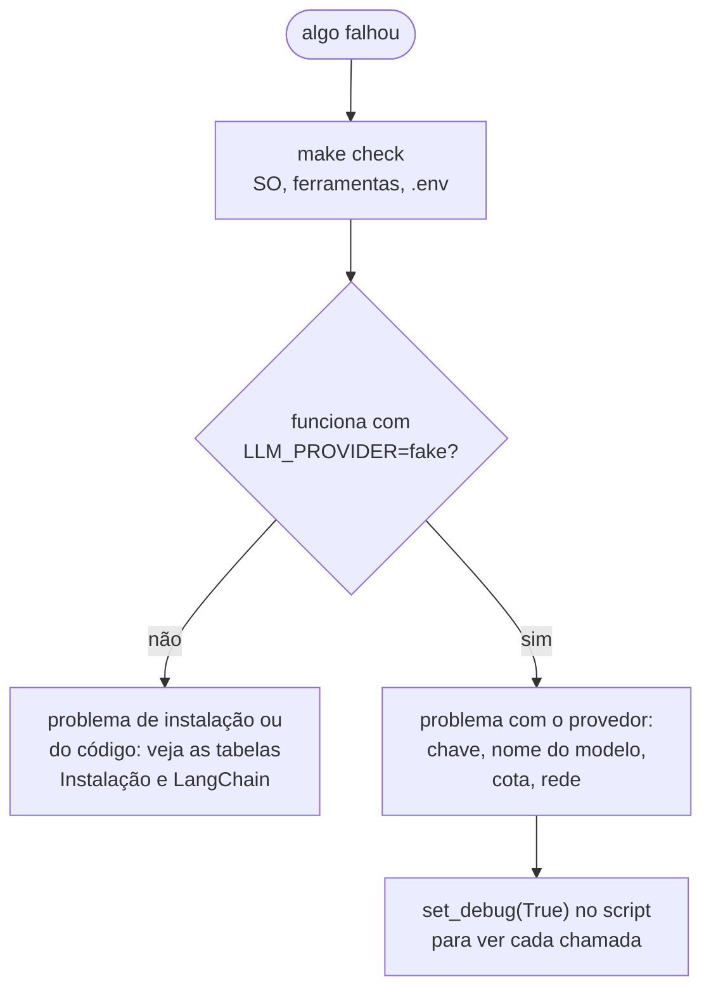

<!-- TOC -->

- [Solução de problemas](#solução-de-problemas)
  - [Como investigar](#como-investigar)
  - [Instalação e ambiente](#instalação-e-ambiente)
  - [Chaves de API e provedores](#chaves-de-api-e-provedores)
  - [LangChain](#langchain)
  - [Testes e qualidade](#testes-e-qualidade)
  - [Go](#go)

<!-- TOC -->

# Solução de problemas

Sintomas -> causas prováveis -> correções. Cada módulo também tem a sua
seção "Erros comuns".

## Como investigar

1. `make check` - confere SO, ferramentas e `.env`.
2. Rode o mesmo script com `LLM_PROVIDER=fake`. Se funcionar, o código e a
   instalação estão certos e o problema está na comunicação com o provedor.
3. Leia a **última** linha do *traceback* primeiro: ela tem a exceção.
4. Ative `set_debug(True)` (os scripts `5-sumarization-map-reduce-pipeline.py`
   e `4-agent-review.py` perguntam se você quer) para ver cada etapa.

## Instalação e ambiente

| Sintoma | Causa provável | Correção |
|---|---|---|
| `uv: command not found` | uv não instalado ou fora do `PATH` | [`REQUIREMENTS.md`, seção 3](../REQUIREMENTS.md#3-software); abra um terminal novo |
| `mise: command not found` depois de instalar | ativação não configurada no shell | [`REQUIREMENTS.md`, seção 3.3](../REQUIREMENTS.md#33---gerenciando-versões-com-mise) |
| o mise avisa que o `mise.toml` não é confiável (*not trusted*) | primeira vez no diretório | `mise trust` |
| `ModuleNotFoundError: No module named 'learning_langchain'` (ou `langchain`) | script executado com o Python do sistema | use `uv run python ...` na raiz do repositório, ou `uv sync` |
| `requires-python >=3.14` ao instalar | Python mais antigo | deixe o `uv` baixar o 3.14 ou rode `mise install` |
| Script "parado" esperando | ele está esperando você responder um `input()` | pressione ENTER para o padrão, ou rode com `< /dev/null` (como o `make run-all`) |

## Chaves de API e provedores

| Sintoma | Causa provável | Correção |
|---|---|---|
| Erro de autenticação, chave inválida ou ausente | `GOOGLE_API_KEY`/`OPENAI_API_KEY` vazia, errada ou ainda com o texto de exemplo | confira o `.env` ([`REQUIREMENTS.md`, seção 5](../REQUIREMENTS.md#5-chaves-de-api-e-o-arquivo-env)) |
| `.env` ignorado | variável já definida no shell (ela tem prioridade) | `env \| grep LLM_` e `unset` o que não quiser |
| Modelo não encontrado | nome de modelo desatualizado | defina `LLM_MODEL`; `4-agent-review.py` lista os modelos Gemini da sua chave |
| Erro de cota / muitas requisições (*rate limit*) | limite do plano do provedor | espere, reduza chamadas (`make run-module` em vez de `run-all`), confira a sua cota no painel do provedor |
| `LLM_TEMPERATURE` não muda nada com OpenAI | modelos `gpt-5` (exceto `gpt-5-chat`) só aceitam `temperature=1`; o `langchain-openai` descarta outros valores | esperado - veja o [módulo 1](../1-fundamentals/README.md#temperatura) |

## LangChain

| Sintoma | Causa provável | Correção |
|---|---|---|
| `No module named 'langchain.chains'` | código de tutorial anterior ao LangChain 1.0 | use LCEL ([módulo 2](../2-chains-and-process/README.md)) e `create_agent` ([módulo 3](../3-tools-and-agents/README.md)) |
| `set_verbose(True)` não mostra nada | sem efeito visível em LCEL/agentes nesta versão | `from langchain_core.globals import set_debug; set_debug(True)` |
| `.content` às vezes é uma lista | alguns provedores devolvem *content blocks* | use `message.text` |
| Aviso de depreciação ao usar `message.text()` | `.text()` como método está depreciado desde o `langchain-core` 1.0 | use a propriedade: `message.text` |
| `NotImplementedError` em `bind_tools` | modelo falso genérico com `create_agent` | `learning_langchain.models.FakeToolCallingModel` |
| `ValidationError` com saída estruturada | o modelo preencheu o schema com valores inválidos | melhore as descrições dos campos; trate a exceção |
| `NameError: name 'np' is not defined` | `numpy` ausente (vector store em memória, embeddings falsos) | `uv sync` |

## Testes e qualidade

| Sintoma | Causa provável | Correção |
|---|---|---|
| Teste passa no seu terminal e falha em outro | dependência do seu `.env` | os testes já removem `LLM_*`; não leia outras variáveis sem `monkeypatch` |
| `make coverage` falha em 80% | código novo sem teste | escreva o teste ([`TESTING.md`](TESTING.md)); `SKIP_COVERAGE_CHECK=1` só para ver o relatório |
| `make lint` reclama de formatação | arquivo não formatado | `make format` |
| `make typecheck` falha | tipos incompatíveis | leia a mensagem do mypy; anote os tipos das listas de `fake_responses` como `list[str \| AIMessage]` |

## Go

| Sintoma | Causa provável | Correção |
|---|---|---|
| `go: go.mod requires go >= 1.27 (running go 1.24.7; GOTOOLCHAIN=local)` | Go antigo com `GOTOOLCHAIN=local` | `mise install` ou `GOTOOLCHAIN=auto` |
| `x509: certificate signed by unknown authority` | certificado interno/autoassinado | instale a CA, ou `certcheck -insecure` só para ler datas |
| `WARNING: DATA RACE` | goroutines escrevendo na mesma variável | cada goroutine no seu índice, `sync.Mutex` ou canais |

Mais detalhes em [`5-golang-for-devops/README.md`](../5-golang-for-devops/README.md#erros-comuns).
